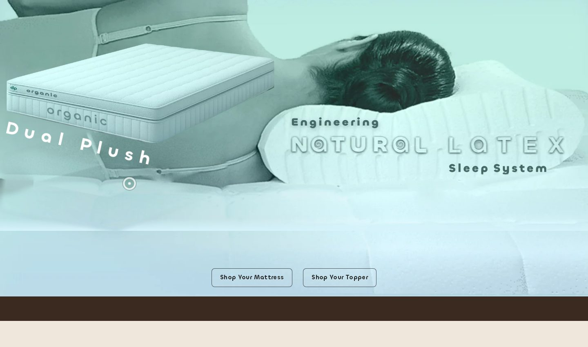
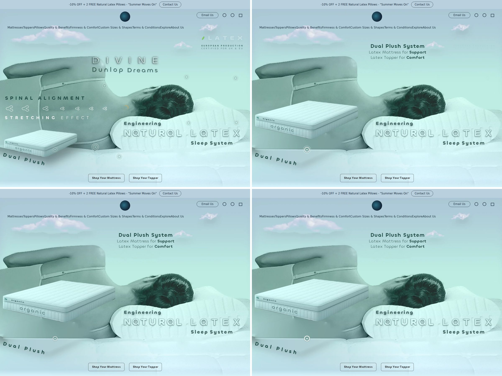
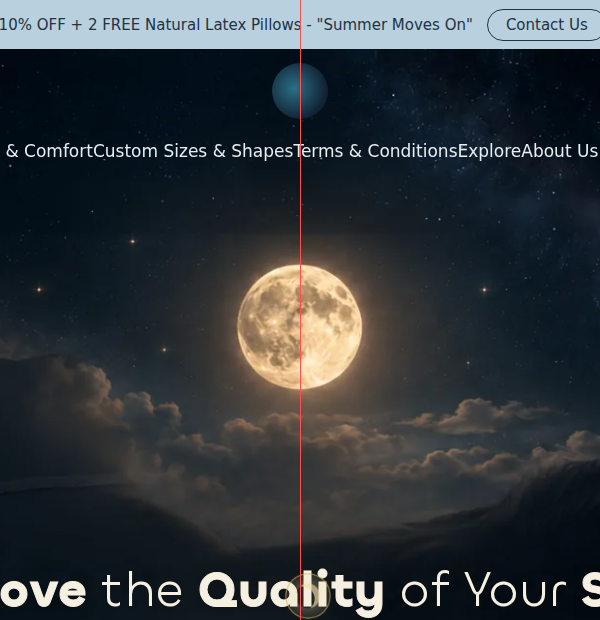
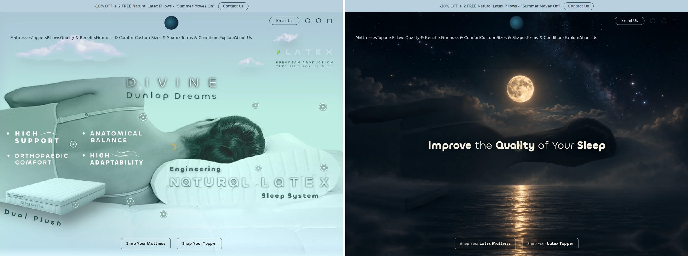
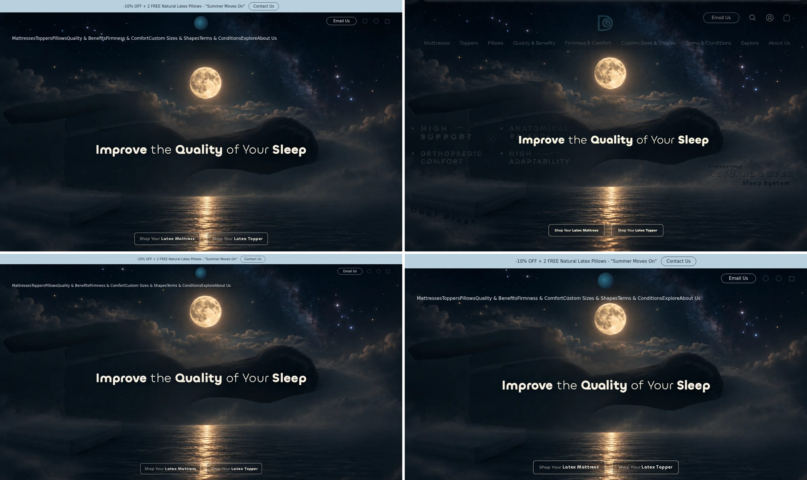
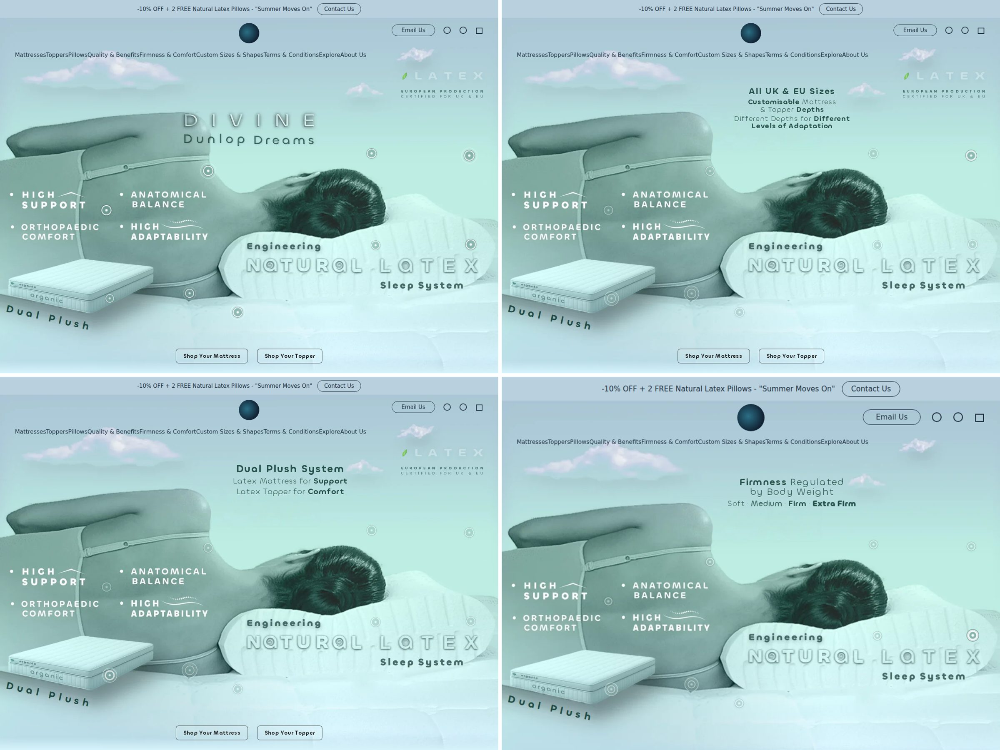
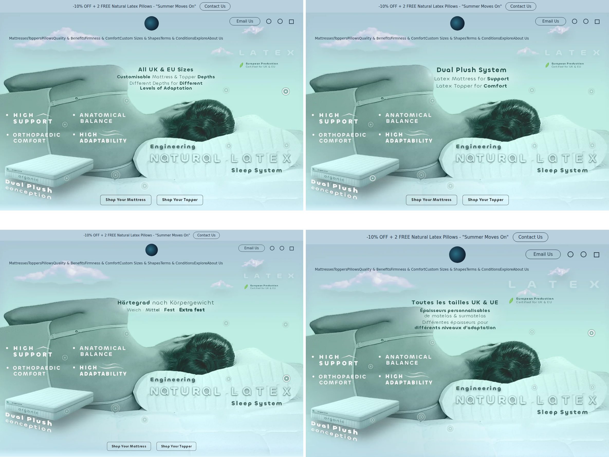
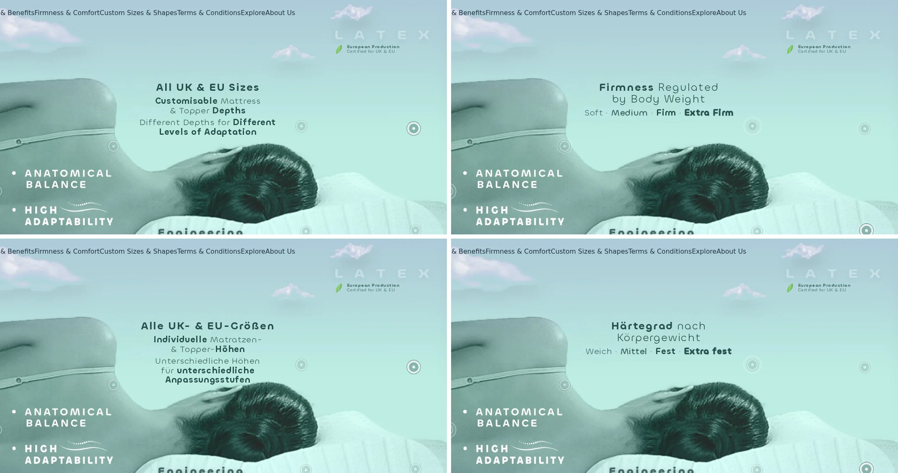
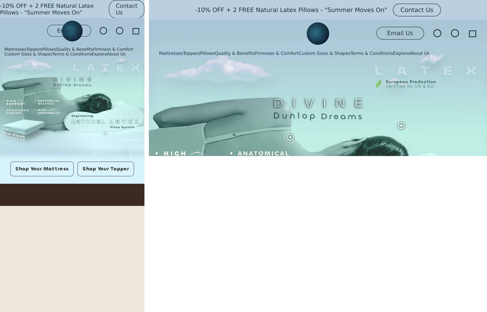

# Divine DunlopDreams Hero — engineering & design polish report

## 1.17.0: firmness navigator, owner's Pantone colour system, old Dual Plush visual, latex wording, step strip (2026-10-10)

Owner brief (9 points, Bulgarian, with a Bio cell picture and four Pantone swatch sheets). Rules recorded in HANDOVER.md §11.
Done:
1. Dual Plush card: the old visual is back (product picture with "Latex topper / Latex mattress" labels, eyebrow, two sentences) on every screen; on short windows title and text sit beside the picture and the three combinations are three equal boxes in one row.
2. Wording: our mattresses are "latex mattress" everywhere (11 strings × 9 languages: combinations, Dual Plush texts, Partners, table headers, model positioning).
3. Pair tables: every option row and box is the same size (no larger box for Extra Firm).
4. Dark boxes always carry white text (Firm / Extra Firm tiles and layers, Bio Support Dual bottom layer, Partners "Firm" side).
5. Colour system from the owner's Pantone sets (7541-7546 Nordic blue-grey, 7457-7460 sky blue): firmness ramp Soft 7457 · Medium 7458 · Firm 7545 · Extra Firm 7546 for tiles, layers, dots and ribbons; firmness words in ink (no coloured words); family accents from the same palette. White + ink-blue stay the text colours.
6. "Back to the overview" left the picture: it sits beside "View model" (built into every preview by tests/build.mjs).
7. Firmness point opens a large firmness navigator (full panel over the header, closes like every card): the engineering statement, three systems side by side (Solo firmness with ranges and models; Dual Plush with the three combinations and models; Partners comfort with Medium/Firm sides and models), every model a direct link, an assurance line and "Selection guidelines, not medical rules". 17 new strings × 8 languages (machine-written).
8. "Pick your model → set size, firmness, depth & cover → buy" is a three-step strip (current step dark) in both selectors.
9. Cubist layout: blocks with rounded corners, equal tiles, consistent gaps.
Tests: see the 1.17.0 commit; guards add a check that the navigator has three systems and 10 model links; panels skip the header/lockup rule for the navigator (it covers them by design); cardfit/fit as before. Known: on 1080x668 a few long translations scroll a few pixels inside a preview panel; the navigator's per-system sentence steps aside below 700 px height.

## 1.16.0: one readability standard for every section (2026-10-09)

Owner rule (after seeing 1.15.1 on his iPad): good readability, good contrast, quality of spacing and arrangement are one rule for ALL sections, not fixed section by section; there are no screen limits, the layout may adapt to the rules; the result must give clarity and navigation.

Standard applied everywhere: ink #14223b / #2b3b58 / #1f4568 (>= 8-9:1), body 16 px, secondary 15 px, labels 13-14 px, no light greys, 8 px spacing grid, nothing hidden by a smaller window except optional lines (and nothing cut mid-word or mid-sentence), generous air under title bands.
Done (beyond 1.15.0 / 1.15.1): 
1. Pairing tables (Botanic Dual Plush, topper Bio Support Dual) rebuilt: the Botanic table is transposed (Option 1-3 down the side, Topper | Mattress across) with 15 px tiles that no longer wrap or overflow; the topper combinations are two cards with 13.5 / 16 px labels. Partners Topper: the faint "on one side / on the other" is now readable.
2. Global size guide: wider (up to 980 px), three columns, 15.5 px names and sizes, 13.5 px inches, title and subtitle on one line, rises over the site header like the selectors; all 23 rows visible on a 668 px window.
3. Dual Plush card: same structure, content and pictures; wider (up to 900 px), 16 px copy, 15.5 px combinations on one line each, 13 px tags, light palette, both buttons visible (they were cut off on short windows).
4. The hero's own small lines: darker ink for "100% EU-UK Certified / Latex (Rubber) Foam", "Best Air Ventilation / Temperature Comfort", "Spinal Alignment / Stretching Effect" (with a soft shadow) and the "European Production / Certified for UK & EU" lines (second line now semi-bold).
5. Bio Comfort screen: ink and sizes as in 1.15.0, labels 12.5 px and up.
6. Panels test: lowest line contrast 8.71:1 (1.14.0: 4.86).
Tests: interaction 381 / 381 / 375 / 375, panels 792, guards, axe 0, fit15 (selectors, size guide, Dual Plush card, Bio screen; 9 languages; 1080x668, 1280x720, 1440x900): 0 problems, cardfit15 (context cards): English clean, Spanish / Portuguese Original Dunlop 12 px over at 1080x668 (scrolls). New: tests/gallery15.mjs (every section as one screenshot). Screenshots: reports/compare/1.16.0-*.png.

## 1.15.1: context cards keep their air and their content on a 668 px iPad window (2026-10-09)

Owner report (two iPad screenshots of the live site): Natural Adaptation opened with an empty picture area and the seven zone tiles missing; Firmness Regulation had its title band squeezed against the tiles, no air between the band and the firmness tiles.

Causes found: (1) the band's breathing space came from the margin of the *next sibling* (`.ddh__hc-hd + *`), and that sibling is the optional intro line, which disappears from tier 1 on, so the tiles touched the band; (2) the card's compaction tier was measured once, when it opened: a picture or the web font arriving a moment later (slow connection) changed the height afterwards and the tiles were pushed out of the card; (3) at tier 3 the Original Dunlop card showed only 1 of its 3 steps.
Done:
1. The title band keeps its own margin (16 px, 14 px in the lowest tier) and padding in every tier, independent of what follows it.
2. The card is measured again when its pictures load or fail, when the font is ready and 0.2 / 0.6 / 1.4 s after opening (`replaceSoon`); its pictures are loaded eagerly when it opens.
3. Lowest tiers: the zones picture steps down in height (122 / 100 px), the Dual Plush panel's sub-heading steps aside, tiles are slightly tighter; no text gets smaller. Original Dunlop shows all three steps (the first with its sentence, the other two with their titles side by side). If a card is still too tall (longer translations) it widens, and whatever is left scrolls inside it.
4. New check `tests/cardfit15.mjs` (tier, overflow and band gap for every card, per viewport and language).
Tests: interaction 381 / 381 / 375 / 375, panels 792, guards, axe 0, fit15 0 problems (en, 1080x668 to 1440x900), cardfit15: English clean from 1080x668; Spanish and Portuguese Original Dunlop over by ~12 px at 1080x668 (scrolls).

## 1.15.0: readability first, one selector size from every entrance, an invitation to explore the points (2026-10-09)

Owner brief (Bulgarian, with three annotated iPad screenshots): text and contrast of the selector panels, topper guide and model preview are hard to read; the model selector looks smaller when it opens from the site menu (Mattresses) than from the hero button; add a quiet call to explore the points on the start page; everything else is perfect. Design rule from the owner: type must be easy to read for people with or without one-dioptre glasses; visual ease of reading is always a task of great importance.

Done:
1. Contrast: the ink family of the selectors, the context cards and the Bio Comfort screen is darker. Body copy was #47587a (5.8-7.1:1), now #2b3b58 (9.2-11.2:1); labels #3b5f82 to #1f4568 (8.1:1); buttons and links #2a638e to #1f4f78 (white on it 8.6:1); the card band #3e7093-#29506f to #2a5a82-#1f4a6e; family tags darkened (botanic #2c5a3d, bio #14606b, orthopaedic #6a4623, partners #2b5f5d, value #3a4d5f); the seven-zone numerals #bcdcf0 to #e6f1fa; the Bio screen firmness colours darkened. Measured with `tests/contrast15.mjs` (lowest selector contrast 7.2:1).
2. Type: body copy 16 px and up (was 13.5-15), labels 14-15.5 px, uppercase family tags 13 px (were 9.5-11), heights 14 px, preview text 16-17.5 px, Bio screen text 15.5-16 px (was 12.6-14). When room runs out, optional lines and spacing give way (tiers by panel height), never the size.
3. One selector size: from the site menu the selector now rises exactly where and as big as from the hero button (before: 110 px lower and smaller, so intro lines, tags and type were dropped). A click right over the menu link still follows that link (the panel covers the menu while it is open; `navOrigin`), and the panel does not close under a pointer that has not moved yet (Safari sends no boundary event: `navGrace`).
4. Mattress list: names are never cut ("Orthopaedic Coconut Coir", "Hotel Line Shredded Latex" show in full; the list column is 45 % wide, 47 % on narrow panels); translated long names wrap or get a wider list.
5. Descriptions are not cut mid-sentence any more: the mattress preview picture gives up height first; the topper preview shows its sentence on panels from 800 px, below that the picture, two benefits, firmness and the button keep the room (the chip and the third benefit step aside on short panels).
6. Invitation to explore: a small frosted line with the pulsing ring of the points, upper left (mirrors the LATEX lockup upper right): "Explore the sleep system / Hover over the glowing points" (touch: "Tap the glowing points"), 8 languages (machine-written, to be checked by native speakers). It appears after the load, steps aside while a card, screen or selector is open, and retires for the visit once three different points were opened (sessionStorage; harmless if blocked). Never on an upright phone. Decorative (`aria-hidden`); the point group already has its own label. The section grows by 270 characters (9,280 external form).
Tests: interaction 381 / 381 / 375 / 375 (one navigation test rewritten for the new behaviour, iPad smooth-scroll wait raised), panels 792, guards (the new copy is allowed), axe 0, perf, new `tests/fit15.mjs` (selector fit: guides and every preview, both entrances, 9 languages, 1051x700 to 1920x1080), `tests/contrast15.mjs` (contrast and size audit), `tests/shots15.mjs`, `tests/pv15.mjs`, `tests/cards15.mjs` (screenshots). Known: Spanish and Portuguese at 1080x668 show the "Opción 1/2/3" labels of the Botanic Dual Plush table close together.

## 1.14.0: one light palette for the selectors and every context card, Dual Plush combinations named (2026-10-07)

Owner brief: take the two colour combinations he supplied (the Bio Comfort screen: lilac-grey canvas with steel-blue tiles and white type; the Partners anatomy cards: white cards on a pale blue canvas with a steel-blue band and navy type) and use them for the mattress selector, the topper selector and all the new cards; name the mixed firmness combinations as Dual Plush combinations; polish the cards as logical, comfortable, easy-to-read visualisations with no size limit.

Done:
1. Palette (tokens `--pl-*`): canvas #e4e8f2 to #f1f4f9, white cards, navy #1d2c47 type, steel-blue band (#3e7093 to #29506f), blue tiles #2a638e, the soft-to-dark firmness steps of the Bio screen (#e8eefa, #d3dbe6, #2a638e, #1d4468). Applied to both selectors (list cards, guides, previews, buttons, firmness blocks, topper footer) and the five context cards. The Dual Plush card is untouched.
2. Context cards: a steel-blue band carries the title and subtitle (with the close X), white panels carry the information. Natural Adaptation: the owner's cut-out on a pale panel over seven blue numbered tiles. Original Dunlop: three numbered steps (Pure natural latex, Custom solutions, Fine tuning) with a one-line goal. Firmness Regulation: four tiles soft to dark with exact ranges, then a Dual Plush combinations panel (heading, one sentence, three pairs). Cover Options: four photographed covers in a row, the zip band, the washing and non-toxic line. Balance and Relief: the mission as a white quote card.
3. Dual Plush wording: "Dual Plush combinations" on the firmness card, "Dual Plush mix" on the pair tables of Botanic Dual Plush and Bio Comfort Dual Plush; the sentence says a mattress and a topper, each with its own firmness, are combined to fine-tune the feel (8 languages).
4. Size: cards are wider (up to 800 px) and type is 16.5 to 19 px; on lower screens the spacing tightens first, then optional lines step aside in tiers 1-3 (the card also widens), never a smaller type than 15 px for text. Every card fits in all 8 languages down to 1280 x 720.
5. Behaviour unchanged from 1.13.0: hover opens, the card closes when the pointer leaves, the X, Escape, a tap outside on touch.
Tests: interaction 379 / 379 / 375 / 375, panels 792, guards (new: the firmness card names its Dual Plush combinations), axe, perf, fit matrix. Screenshots: reports/compare/1.14.0-*.png.

## 1.13.0: dark cards with white type, graphite selectors, real covers, exact weight ranges (2026-10-06)

Owner corrections after 1.12.0 (Bulgarian brief, 6 points) and the follow-up (darker green, no Dual Plush change, ugly blue behind the seven zones, see-through head, closing behaviour, firmness colours, bigger type for people who wear glasses).

Done:
1. Mattress selector: blue graphite (#101c2a to #213a50), every surface dark glass with white type; list cards keep picture, family, name and facts (the description lives in the preview). Topper selector: much darker graphite with only a faint green sheen (#090e0d to #16211e), mint accents, gold call to action.
2. Context cards redesigned: deep petrol graphite, white letters, mint accents, almost opaque (nothing behind them shows through, which also removes the reflection of the lettering and the hair). Type 17 px body, 27-34 px titles; cards are wider (up to 600/680 px). On short screens optional lines drop out in tiers (never smaller type); the Natural Adaptation strip becomes 4 + 3 when narrow.
3. Natural Adaptation uses the owner's cut-out picture flattened on a solid dark panel (no transparency, no blue panel) over seven numbered, translatable zone tiles.
4. Original Dunlop Technology: no mention of layers (guarded in 9 languages); the message is custom made and fine tuning.
5. Firmness Regulation: exact ranges, no "approximately" (guarded): Soft up to 48 kg (confirmed), Medium 47-83 kg, Firm 85-110 kg, Extra Firm from 120 kg; the small "sometimes up to about" notes are gone. The four levels use the blue-graphite steps of the mattress selector.
6. Cover Options from the owner's source picture: 100% Organic Cotton, Cotton & Wool, Aloe Vera Cotton, Cashmere with Silver Ions (no cotton blend), with their photographs; "Every cover has a durable zip for easy removal and maintenance"; "Washable at up to 40 C, non-toxic, non-sprayed".
7. Closing: a card closes when the pointer leaves its point and the card, with the X, with Escape, and on touch with a tap outside; a tap on the card text no longer closes it. Points under an open card are hidden and out of reach until it is closed.
8. Dual Plush: unchanged from 1.12.0 (the 1.13 tweaks were reverted); awaiting the owner's answer on what to restore.
9. Also fixed: the header-bridge grace (450 ms) after a rare race under load; short-screen fits of the topper selector (guide and preview).
Tests: interaction 379 / 379 / 375 / 375, panels 792, guards (new: no layers, no approximation, real covers), axe, perf, fit matrix. Screenshots: reports/compare/1.13.0-*.png.

## 1.12.0: orientation guides in the selectors, five context cards, Dual Plush card without heights, no gendered wording (2026-10-06)

Owner brief ("Complete Implementation Brief", 5 iPad screenshots): selectors open on a guide (no preselected model); light liquid-glass context cards for the hotspots; Firmness Regulation and Cover Options replace two points; Dual Plush card explains the system per model; no "Her/Him"; nothing covers the CTAs, LATEX block, navigation, the size control or the chat.

Done:
1. Selectors: the Mattress selector opens on "Which 100% latex mattress is right for you?" (5 groups, model buttons, "Choose a model to preview"); the Topper selector opens on its made-to-order intro, Bio Support / Bio Support Dual / Partners Topper. No model is preselected. Hover / focus / tap previews a model, the last preview stays, "Back to the overview" returns to the guide. No prices.
2. Context cards (one at a time, close button, Escape, keyboard and touch): A Natural Adaptation with the 7 support zones (Head · Shoulders · Back · Pelvis · Knees · Legs · Ankles); B Original Dunlop Technology → Custom Made Sleep Systems; C Firmness Regulation (four weight ranges, "Selection guidelines, not medical rules.", Dual Plush examples); D Cover Options (four covers, "Every cover has a zip"); E Balance & Relief. Each card sits 16 px under the LATEX lockup and ends 16 px above the Shop row, or on screen when the Shop row is below the fold. When the copy would not fit, a compact layout hides the small weight notes; on short screens (e.g. 1280 × 720) a second step also hides the lead line and the example rows (Firmness keeps its Dual Plush sentence). Points under an open card dim and stay clickable.
3. Point repurposing: the upper right point (was "sizes" copy) now opens Firmness Regulation; the lower one (old weight spot) opens Cover Options. The global "All UK & EU Sizes" control is unchanged, away from the chat.
4. Dual Plush card: "What is Dual Plush?", topper above / mattress below, combinations marked "Botanic · Bio Comfort" or "Botanic only", "View Botanic Dual Plush" and "View Bio Comfort Dual Plush". The 23 / 28 cm heights were removed from this card (unverified).
5. Partners: "One side" / "Other side" instead of Her / Him, in 8 languages.
6. Cards are on above 700 × 500 px; phones keep the short copy (no selectors, as before).
Needs owner confirmation: the second Organic Cotton cover's name (shown neutrally as "100% Organic Cotton, second option"); the topper selector footer still lists "Cotton & wool" and "Cashmere"; Bio Support Dual vs Bio Support Plus naming (URL says plus); Dual Plush heights on the selector cards (23 · 28 cm, from the 1.10.2 product screenshots); the Dual Plush combination availability per model; live product links (divinedunlop.com is blocked from the build sandbox).
Tests: interaction (4 previews), panels (now also checks each card clears the header and the lockup and shows all of its content), guards, axe, perf, fit matrix. Screenshots: `reports/compare/1.12.0-*.png`.

## 1.11.2: Bio Comfort picture recovers on its own; size trigger becomes a round badge, set well apart (2026-10-06)

Owner (on the live iPad): the Bio Comfort model did not show its picture (a broken-image icon in its list card and in the large preview); the "All UK & EU Sizes" button sat too close to the Topper button and to the chat bubble and looked like the two main buttons.

Done:
1. Bio Comfort picture: the file `m-bio.webp` is intact and encoded exactly like the pictures that load (checked: identical blob in the pinned commit, same WebP structure as the other model pictures), and the sandbox cannot reach jsDelivr, so a one-off failed fetch from the CDN is the most likely cause. Every picture in the screens is now asked for again, twice, with a short pause, if its first load fails; if it still fails it is hidden quietly (the card keeps its soft background, name and text) instead of showing a broken-image icon. Tested in a browser: first request blocked → the picture still shows after one retry; always blocked → 3 requests, then a calm empty panel.
2. Size trigger: no longer a bordered pill. It is a round dark-teal ruler badge with a plain underlined label. Placed at least 74 px from the Topper button (typically 80-95 px) and at least 130 px from the right edge on every computer width (iPad Pro landscape included; the chat bubble occupies about the last 118 px). On widths 1051-1320 px the label sits under the badge so it stays clear of the chat; on tablets and phones it is its own centred line under the Shop buttons. The two Shop buttons stay exactly centred.
3. Bug caught by the new retry test before release: the first draft passed a bare `true` to the hero's `on()` helper (it takes an options object), which would have loaded the screens twice and broken them; fixed to `{ capture: true }`.
Tests: interaction (incl. new tests for the retry, the quiet fallback and the badge distances), panels, guards, axe, perf, fit matrix.

## 1.11.1: cube model cards with family accents, richer topper preview, Dual Plush reveal card, size pill clear of the chat (2026-10-05)

Owner (on 1.11.0, approved direction): calmer, more precise "configurator" feel; 2 mattress cards per row, closer to cubes, little text; family colour accents; topper preview too empty (on the live iPad its picture had been hidden on a low panel) and header text showed through it; a Dual Plush explanation card with the lifted mattress; the size pill clashed with the chat bubble.

Done:
1. Mattress cards: 2 per row, picture on top, family tag, name, one/two-line positioning, heights and firmness marks (dots in the firmness colours; Dual Plush pairs as small two-layer marks; Partners as one split mark). Family accents (thin top line, active ring, soft picture light): Botanic green, Bio Comfort aqua, Orthopaedic coconut brown, Partners teal + violet, Ambient / Hotel Line slate.
2. Previews: a soft family light behind the product, a quiet floor line, a product shadow, a thin family accent on top.
3. Toppers: the picture never hides any more and sits beside one clear text column; Bio Support shows its five benefits from the brief (the topper header list moved into it), Bio Support Dual four, Partners Topper four. All screens opened from the hero now rise over the site header (the topper and Bio screens had header text showing through on the live site).
4. Dual Plush reveal: with the lifted mattress (desktop and tablet; not phones) a light card explains the system: topper / mattress picture, two short paragraphs, the three combinations as layered marks, height 23 or 28 cm, "View Dual Plush" (Botanic Dual Plush) and "Also with the Bio Comfort core" (Bio Comfort Dual Plush). The lift holds while the pointer travels towards the card ("safe triangle"), stays while on it, and closes at once in any other direction.
5. "All UK & EU Sizes" sits just right of the Shop buttons (they stay centred), at least 120 px from the right edge on computers; on tablets and phones it is its own centred line under the buttons.
Tests: interaction 374/374 (370 on the bare harnesses), panels, guards, axe, perf; fit matrix clean.

## 1.11.0: model selector (direct product links + large preview), global size guide, header bridge (2026-10-05)

Brief: upgrade (not redesign) the product layer: browse every mattress and topper quickly, see the differences, go straight to
a model or to the collection; one global "All UK & EU Sizes" guide; optional bridge from the native header; no prices; Ecwid-safe.

Done (details, data structures, performance and the URLs to verify: `UPGRADE-1.11.0.md`):
1. Shop Mattress / Shop Topper panels are now a model selector: a compact list (about 38%) and one large preview (about 62%). Rows and "View model" link straight to the 11 product pages (Ambient Topper excluded); "View the collection" stays once per panel. Data: `src/models.json`; the build generates the rows and checks every preview links to the same URL.
2. Global size guide: a quiet pill beside the Shop buttons; 22 sizes + Custom, two columns (one on phones, as a bottom sheet), no prices. Data: `src/sizes.json`.
3. Prices removed from the hero (the topper's "Cashmere +£77"); the build refuses any price in the panels.
4. Keyboard: focus on a Shop button opens its selector, Tab enters the list, focus previews, Escape returns to the button. Touch: first tap previews, second opens. Phones keep the 1.10.1 decision (no selectors), the size guide works there.
5. Header bridge: hovering / tabbing to the site header's own "Mattresses" / "Toppers" opens the same selector under the header; the header is never modified; mouse on a computer only.
6. Fixed while building: a touch first focuses a link, which counted as "already previewed", so the first tap navigated; and Escape's return of focus reopened the panel.
Tests: interaction 370/370 (366 on the bare harnesses), panels 792, guards, axe 0, perf unchanged; fit matrix (5 languages × 5 screen sizes × every preview) clean.

## 1.10.9: equal cards, tags off the pictures, Botanic Dual Plush inside its card, no English leftovers (2026-10-05)

Owner: the Botanic Dual Plush firmness block spilled out of its card; the tags (Exclusive...) sat over the pictures and the model's head; the top row cards were bigger than the bottom row.

Done:
1. All eight cards are exactly the same size (both rows weigh the same; measured: height difference 0 at 30 window sizes from 1280x700 to 1920x1080).
2. The tag sits on its own line above the picture on every card; nothing covers a visual or a face. The Partners Her/Him badges are centred again.
3. Botanic Dual Plush: the pairs table fits inside the card at every panel height: below about 790 px of panel the two group labels become screen-reader-only (headings stay), the "Firmness" caption of the table is read-only too, the pairs get the width, and on very low panels the model's subtitle steps aside. Checked in 6 languages and at emulated panel heights down to about 500 px.
4. Bug found and fixed (since 1.10.7): in every language but English the Bio Comfort Dual Plush card showed an extra English pair ("Firm + Medium") because the translation renderer stops at the first closing span; the pairs are now `<em>` lines. New guard: every language keeps the same number of firmness words, pair lines, cards and layer chips as English.
Tests: interaction 348/348 (347 harness), panels 792, guards (incl. the new language-structure guard), axe 0 violations, perf unchanged. Screenshots `reports/compare/1.10.9-*.png`.

## 1.10.8: the mattress panel covers the header; graphite restored; more text contrast (2026-10-05)

Owner: pull the panel up over the bar and the logo to use the whole screen; more font contrast; bring back the old colour of the main card.

Done:
1. The mattress panel starts 10 px under the top of the hero and covers the logo and the menu while it is open (the hero is lifted above the header only while the mattress panel is open: `.ddh[data-ddh-open-sheet=mattress]{z-index:2147483000}`; desktop pointers only). It keeps a clear gap above the Shop buttons at every width. The cards gain about 110 px of height.
2. The main card colour is the old graphite gradient again (#003136 removed).
3. Contrast and size: eyebrow, lede, steps and group labels are brighter; card titles, descriptions and specs are darker; with a roomy panel (cqh >= 690) title, lede, card titles, descriptions and specs are larger, the Firmness label sits on its own line above the values (one clear scan line per card), "Extra Firm" / "Super Firm" never split.
4. Small panels keep the compaction from 1.10.7 (it follows the panel height).
Tests: interaction 348/348 (347 harness), panels 792, guards, axe 0 violations, perf unchanged. If the live header still shows through, send its z-index/stacking (the hero must be able to rise above it).

## 1.10.7: mattress panel #003136, taller and self-fitting; Bio Comfort opens on hover (2026-10-05)

Owner: panel background #003136; panel higher with more room for the eight cards, readable and not cramped; Bio Comfort point opens on hover (not only click); inspect everything as a senior designer.

Done:
1. Mattress panel: solid #003136 (cards stay light); starts 2 px above the previous top and ends 4 px lower, so the cards get about 8 px more height.
2. Fit follows the PANEL's own height, not the window's: the desktop sheet is a size container (`container:ddsh/size`) and the low-height compaction rules (formerly `@media (max-height:820/760px)`) are now `@container ddsh (max-height:600px / 530px)`. A tall window with a tall site header (small panel, as on the owner's iPad screenshot) no longer squeezes the cards into overlapping text.
3. Card spacing: gap 9-14 px, card padding 8/12, text line-heights opened a little (Chillax only).
4. Bio Comfort point: hover opens the screen after 140 ms (desktop pointers only), leaving closes it after 280 ms, click or keyboard pins it as a dialog; touch is unchanged (tap opens full-screen). New tests.
5. Designer fixes: the Partners tag no longer overlaps the Her/Him badges (badges sit on the lower edge; at about 720 px high the small "Zone for Her/Him" caption is dropped, the firmness line below still says it); Bio Comfort Dual Plush pairs are one line each (Medium + Soft / Firm + Medium).
Tests: interaction 348/348 (347 harness), panels 792, guards, axe 0 violations on every screen, perf unchanged. Screenshots: `reports/compare/1.10.7-*.png`.

## 1.10.6: clear Botanic Dual Plush pairings, violet Firm, solid topper edges (2026-10-05)

Owner:
1. Botanic Dual Plush: the three firmness combinations looked mixed; show which firmness plays with which.
2. The Firm colour (amber) is disliked: use another.
3. The topper pictures show holes and torn-off pieces along their sides.
4. Bio Comfort Dual Plush has no Extra Firm + Firm.

Done:
1. Botanic Dual Plush now shows a small table: Option 1 / 2 / 3 as three columns, each a two-layer stack (Topper over Mattress): Soft on Medium, Medium on Firm, Firm on Extra Firm. Labels are translated (new keys `opt_3`, `l_tp`, `l_mt`, `w_x`).
2. Firm is violet (#6b46c1 on light cards, #cdb8ff on dark panels, lavender layer chips); Soft blue, Medium teal and Extra/Super Firm vermilion are unchanged. axe contrast: 0 violations.
3. `t-bio.webp`, `t-bio-dual.webp`: the silhouette is rebuilt as the convex hull of the cleaned cut-out (a latex slab is convex), dents filled from the nearest real pixels, edge antialiased (`tests/clean-topper-edge.py`). `t-partners.webp`: stray strip and specks below the picture removed.
4. Bio Comfort Dual Plush (card and Bio screen) lists only Medium + Soft and Firm + Medium (new key `f_bdp`; `f_dp` retired).
Fit: on computers the pictures give way first, so no card spills at 1920x1080, 1440x900, 1366x768, 1280x720; at about 720 px high the lists/helper lines give way to the pairings. Checked in all 8 languages (no overflow of the pair chips).
Tests: interaction 347/347 (346/346 harness), panels 792, guards, axe 0 violations (all screens), perf unchanged. Screenshots: `reports/compare/1.10.6-*.png`.

Note: the owner's message ended mid-sentence ("The goal is…"); nothing was assumed.

## 1.10.5: coloured firmness, a cleaner Bio Comfort, clean toppers, the core as the feature (2026-10-05)

Owner:
1. In the mattress section every firmness gets its own colour.
2. Bio Comfort looked blue: clean it to a fresher latex white.
3. The cloud was stuck at the top and looked painted. Make it natural, not a drawn cloud.
4. Ambient must clearly read "best value latex mattress".
5. All English must be correct British English.
6. "Dual Plush" must not appear twice in a card (tag and title).
7. Make the mattress and topper colours match; no strange shapes at the topper's sides.
8. Seven zones as a plain fact; show the core, the concept behind Bio Comfort (special support, Anatomical Cloud design), not tiny icons.

**Changes**
* **Firmness colours (all cards, all 8 languages):** Soft blue, Medium teal, Firm amber, Extra Firm and Super Firm vermilion. On the dark topper panel the brighter variants are used.
* **Mattress cards:** Bio Comfort cards are fresh latex white (no blue cast); tags are cool neutral.
* **Cloud:** replaced by soft natural mist: fog in the corners and a feathered cloud bank under the mattress, so it floats on it. There is no pasted cloud shape, and the cloud image is gone from the release.
* **Ambient:** tag "Best value"; line "Best value latex mattress".
* **Tags:** Botanic Dual Plush "Premium"; Bio Comfort Dual Plush "Innovation"; Bio Support Dual "Premium". "Dual Plush" appears once per card, in the title.
* **Toppers:** the slab is cut out of the opaque white "shadow plate" that came with the source pictures (that plate was the odd rounded shape at the sides). The outline is smoothed, and the cut-outs sit on dark glass. Topper and Ambient pictures are graded to Botanic's latex tone (measured from the Botanic mattress), so the range matches. All three topper pictures have the same height.
* **Bio Comfort screen:**
  * The seven zones are one slim line: "Seven body zones · Head · Shoulders · …".
  * The three mini icons are replaced by a core panel: the cutaway of the mattress (cover, cellular-capsule core, base; tagged "Anatomical Cloud design"), a large close-up of the cells ("Cellular-capsule core"), the headline "The core is the concept", a sentence on the seven-zone core with its own Synchroniser layer, and a "Highest ventilation in natural latex" tag.
  * New images: the cutaway (52 KB) and the cells (18 KB); two unused pictures were removed.
* **British English pass:** "It shapes itself to you", "Seven-zone" spelled out, "A natural upgrade for added comfort", "Plush, dual-layer comfort", "A dual-comfort concept with two layers of regulation", "Available depths", "Each one has a reason to exist", "Shredded latex designed for hospitality", "Extra firm support, reinforced with coconut coir", "Two comfort levels, joined by a bridge topper".
* Checked at 1920×1080, 1440×900, 1366×768 and 1280×720: no sheet scrolls.
* Tests: 346–347 per harness, panels 792/792, guards, axe 0 (hero and every sheet). Pinned: `ecwid/section-1.10.5-jsdelivr.html` (commit `e6e9fe3`).

## 1.10.4: Partners badges, clear topper layers, a calmer cloud (2026-10-05)

Owner:
1. On the Partners mattress and topper pictures, one side is Firm and the other Medium. Show that marking visibly, as on the product pictures.
2. Bio Support Dual: make clear which layer is Firm and which Medium, and that there are two options.
3. Bio Comfort: the cloud was huge. Keep a cloud, but small. Say it holds you above the surface and that it is Cloud Comfort.

**Changes**
* **Partners:** visible badges "Zone for Her · MEDIUM" (orange) and "Zone for Him · FIRM" (teal). On the mattress card they flank the picture; on the topper card they sit under it. The firmness line says "Her side Medium · his side Firm".
* **Bio Support Dual:** two labelled options, each a two-layer stack (top layer / bottom layer), coloured by firmness.
  * Option 1: Medium on top of Firm.
  * Option 2: Soft on top of Medium.
* **Bio Comfort:** the clouds are now small (about a third of their former size), and a new "Cloud Comfort: it holds you above the surface" note explains that it adapts without sinking and supports without tension, so you rest on the surface, never in it. The note is in the 8 languages. On computers the three sub-lines under it are hidden so the screen fits without scrolling (checked at 1920×1080, 1440×900, 1366×768 and 1280×720); they remain on tablets.
* Tests: 346–347 per harness, panels 792/792, guards, axe 0. Pinned: `ecwid/section-1.10.4-jsdelivr.html` (commit `c786b5a`).

## 1.10.3: graphite instead of brown (2026-10-05)

Owner: brown is not a favourite; stay in the graphite range.

* The mattress preview's stage is now graphite (#1e2225 → #363c41) with a soft cool light. Accents are pale silver-blue instead of gold, and the CTA is light grey.
* Cards and photo panels are cool white; the Bio Comfort cards are pale sky. The Premium/Exclusive/Innovation and Orthopaedic tags are in cool tones.
* Tests: 346–347 per harness, guards, axe 0. Pinned: `ecwid/section-1.10.3-jsdelivr.html` (commit `66b161b`).

## 1.10.2: product-page data; premium skins (2026-10-05)

Owner, with screenshots of the product pages: correct heights and firmness everywhere; a more premium feel; Bio Comfort light and heavenly like its product page; the collection previews premium with contrast and cards, following the mockups (bold type on dark cards).

**Data, from the product pages**

| Model | Heights / firmness |
|---|---|
| Botanic | 20 · 24 · 26 cm |
| Botanic Dual Plush | 23 cm (18 + 5) · 28 cm (20 + 8) |
| Bio Comfort | 23 · 26 cm |
| Bio Comfort Dual Plush | 28 cm only |
| Orthopaedic Coconut Coir | 17 · 20 · 25 cm |
| Partners | 21 cm (2 × 16 + 5) · 25 cm (2 × 20 + 5) |
| Bio Support Dual (topper) | Firm base + Medium top, or Medium base + Soft top |
| Partners Topper | one version: Medium on one side, Firm on the other |

All of it is in the 8 languages.

**Skins**
* **Bio Comfort:** pale sky gradient, the board's own cloud (16 KB), white glass detail cards, deep navy type and zone bar.
* **Mattresses:** dark warm bedroom tone with a soft lamp glow, light cards for contrast, warm-gold accents and a light CTA.
* **Toppers:**
  * Night navy with dark glass cards and bold white names.
  * The product photos sit on light studio panels, because the source cut-outs carry white halos.
  * Firmness words are coloured SOFT (sky) / MEDIUM (cyan) / FIRM (gold), as in the mockup.
  * Gold CTA.
* **Tablets:** the eight mattress cards go 2 per row, so each group of four is a 2×2.

* Tests: 346–347 per harness, panels 792/792, guards, axe 0 (every sheet, desktop and phone). LCP and CLS unchanged. Pinned: `ecwid/section-1.10.2-jsdelivr.html` (commit `cd21377`).

## 1.10.1: tablets and computers only; collection data; loading in two stages (2026-10-05)

Owner:
1. The screens are for tablets, laptops and monitors, not phones.
2. The collection page is the reference.
3. Botanic Dual Plush firmness: Medium mattress + Soft topper / Firm + Medium / Extra Firm + Firm.
4. Ambient also comes at 26 cm.
5. The previews open by hovering the buttons without pressing; leaving without pressing returns the hero to its first state.
6. The first load must stay light; everything else should load straight after, so Google can index it.

**Phones (≤700 px wide, or a touch screen ≤500 px high, either way up)**
* No Bio point, no screens, and the Shop buttons go straight to the collections.
* The phone link under the buttons is removed.
* The screens' text is still loaded into the page there, hidden, so Google's smartphone crawler indexes it; their pictures are not loaded.

**Data, aligned with the collection page**
* Tags: Botanic *Premium*; Botanic Dual Plush *Premium · Dual Plush*; Bio Comfort *Exclusive*; Bio Comfort Dual Plush *Innovation · Dual Plush*.
* Card name: *Orthopaedic Coconut Coir*.
* Botanic Dual Plush shows the same mattress + topper firmness pairs as Bio Comfort Dual Plush, labelled "mattress + topper".
* Ambient: 16 · 18 · 20 · 26 cm, four firmnesses.
* The collection page's path "Pick your model → set size, firmness, depth & cover → buy" sits under the heading.
* All of this is in 8 languages.

**Hover**
* Leaving the button or the preview without a click closes it after 0.28 s. The hero is then exactly as before: no state, no open screen, buttons collapsed. This is tested.
* Tablets: a tap opens the preview full screen, and closing it returns to the scene.

**Loading**
* Stage 1 is the plain scene.
* Stage 2 starts 0.9 s after load, when the browser is idle, at low priority. It brings the screens' text (every device), then on tablets and computers the hotspot graphics, the night picture and the screens' pictures, so every mode opens instantly.
* On data-saver or 2G connections, stage 2 waits for intent.
* LCP and CLS are unchanged (desktop LCP 0.39 s, phone 0.84 s; phone stays at 97 KB).

**Short laptop screens:** the mattress preview tightens its header so the eight cards keep visible pictures at 1366×768 and 1280×720.

* Tests: 346–347 per harness, panels 792/792, guards, axe 0. Pinned: `ecwid/section-1.10.1-jsdelivr.html` (commit `a628ecd`).

## 1.10.0: the Bio Comfort screen and the collection previews; the settle animation removed (2026-10-05)

Owner's brief:
1. A new point that opens a whole screen presenting the innovation, our finest and most expensive model, in its two versions: Bio Comfort and Bio Comfort Dual Plush. Both share one core; Dual Plush adds a topper mixed over the mattress.
2. The Shop Your Latex Mattress / Topper buttons keep their hover and show the collection on hover, like a welcome page to the collection: why each model exists, a map to all of them, Scandinavian-warm.
3. Mattresses: eight models.
4. Toppers: the three main ones, with Bio Support (the original) and its depths.
5. Chillax everywhere; organised for Google and the translations.
6. Drop the movement animation if the code gets heavy.

Sources: the owner's three SVG resource boards (Bio Comfort; mattresses; toppers) and the two mockups. The product cut-outs are extracted from the boards (`release/1.10.0/assets/m-*`, `t-*`, `b-*`, 11–70 KB WebP each, with transparency).

**Bio Comfort point** (green, on her back by the pillow)
* Hover: the teaser "Bio Comfort · Our innovation · Discover" in the logo window, like the other points.
* Click or tap: the Bio Comfort screen, a dialog with focus management, Tab kept inside, Escape and a close button, and focus returned to the point.
* Upright phones, which show no points: a quiet "Bio Comfort · Our innovation" link under the Shop buttons opens it.

**The Bio Comfort screen**
* The message: Bio Comfort completes and improves everything a natural latex mattress already does.
* Copy: lede, then the board's three lines "More natural Support / Reflection / Adaptation", each with one explaining sentence.
* A version switch, Bio Comfort | Bio Comfort Dual Plush (accessible tabs with arrow keys). It swaps the main picture (the woman on each version) and the specs: heights 20/24/26 cm or 25 cm, and firmness.
* The 7-zone bar (Head … Ankles), plus three details: responsive cells (close-up), light & airy support (airflow), anatomical-orthopaedic comfort.

**Collection previews (hover the Shop buttons)**
* Desktop with a pointer: the preview opens over the picture, between the header and the buttons. It stays open while the pointer is on the button or on the preview, and closes on leaving or Escape. A click on the button still goes to the collection, and every card links to it too.
* Touch and narrow screens: the first tap opens the preview full screen (above the site header, page scroll locked), and its own button leads on to the collection.

**Mattresses**
* "Find your ideal latex mattress": eight cards in two rows, *The core line* (Botanic, Botanic Dual Plush, Bio Comfort, Bio Comfort Dual Plush) and *Made for a purpose* (Orthopaedic, Mattress for Partners, Ambient, Hotel Line).
* Each card: tag, name, why-line, heights, firmness. All eight fit at 1366×768 without scrolling.

**Toppers**
* "Improve your current mattress": six benefits, then Bio Support (Original), Bio Support Dual and Partners Topper, each with its explanation and firmness options.
* Footer: available depths 8/10/12/14 cm, the four covers (cashmere +£77), and the CTA.

**Google and translations**
* The section stays under the paste limit: 9.2k characters. The three screens live in one small HTML file per language (`release/1.10.0/sheets/<lang>.html`, 14 KB), 3 KB compressed, fetched 1.2 s after page load or on first intent.
* They are real HTML headings, text and alt text, rendered into the page, so Google indexes them.
* The source is `src/sheets.html` (English), with `data-t` / `data-ta` keys translated in `src/sheets-i18n/<lang>.txt` for the eight languages. The build fails if a language misses a key.
* The teaser and the phone link use the existing i18n JSON.

**Removed: the Natural Adaptation settle animation**
* As the owner allowed, the WebGL module, its masks/plates (65 KB) and its test are gone.
* hero.js is 22 KB → 19 KB with all the new logic; hero.css grows to 44 KB (10 KB compressed). The "Natural Adaptation" point keeps its copy.

**Checks**
* Interaction: 341–342 checks per harness, including a new sheets suite covering desktop hover, click-through, the Bio dialog, phone and iPad full screen, and French.
* panels 792/792, guards, axe 0 (hero and every sheet, desktop and phone).
* LCP and CLS unchanged: phone CLS 0, because the phone link's space is reserved.
* Pinned: `ecwid/section-1.10.0-jsdelivr.html` (commit `d01e702`). Screenshots: `reports/compare/1.10.0-*.jpg`.

## 1.9.4 (final) — the shop buttons; review pass (2026-10-04)

Owner: "Latex" inside both buttons. "Latex Mattress" / "Latex Topper" heavier, as on the night picture. The outline keeps the same space on both sides of the label. Keep the hover effect. Make the buttons beautiful. Review and polish everything for a final version.

**Buttons**
* Markup is now `Shop Your Latex Mattress`. The old trick that showed "Latex" only at night is gone, so "Latex" shows in every state.
* "Shop Your" is regular weight (400). "Latex Mattress" / "Latex Topper" is 600 plus a fine 0.022em stroke, the same technique as the night line's bold words, so it reads thicker with no faux-bold fallback.
* Fixed minimum widths are removed. Each button is sized by its label with the same padding (0.62em × 1.45em), so the space on both sides of the text is identical in both buttons: 22 / 24 / 19 px on desktop / tablet / phone.
* On phones (≤700 px) the label goes onto two lines, "Shop Your" small over "Latex Mattress" bold, so the full name fits side by side down to 360 px.
* Hover, press, focus and the night styles are unchanged: graphite fill on hover/press/focus; light outline and cream fill on hover at night.

**Review**
* Two unused helpers removed from hero.js: `bump()` and the scale helper `sc()`.
* The settle animation's WebGL context is now released when a section is destroyed. Instant Site re-initialises sections as tiles load and unload, and browsers cap live contexts.
* `hero-band-3554.webp` is re-encoded back to its original size (234 KB) after the elbow retouch.
* No CSS selector without matching markup. No horizontal overflow at any of the 20 matrix viewports, from a 360 px phone to a 4K screen.
* Tests all green (329–330 per harness, panels 792/792, guards, axe 0); LCP and CLS unchanged. Pinned: `ecwid/section-1.9.4-jsdelivr.html` (commit `d3dac56`).

## 1.9.4 — a settling, not a performance; the elbow rounded (2026-10-03)

Owner, on the first 1.9.4 preview (the arm rolling in behind her body and back out):
* The arm came out wrong: it seemed to merge into the body, as if piercing it. "Better not move the arm."
* Too abrupt. These are settlings, not movements.
* It didn't look like 3 s: everything happened in about one second, with no separation between the movements.
* Robotic and mechanical, not human.
* The elbow is sharp; it should be rounder.
* The BOTANIC film was a reference for how a body moves and how the mattress takes it, not something to copy.

What changed:

**The arm layer is gone**
* `make-arm.py`, `arm-mask.webp` and `arm-plate.webp` are removed.
* The arm no longer moves on its own. It rides with the shoulder girdle as one rigid piece, so nothing bends and the elbow keeps its shape.

**The elbow is rounded in the photo itself** (`tests/round-elbow.py`, applied once to every width)
* The arm's silhouette at the elbow end is opened with an 85 px disk (master scale).
* The trimmed slivers are filled from the sky and the back around them, never from the arm.
* The skin's dark rim continues along the new edge.
* `sleeper-mask` and `sleeper-plate` are rebuilt from the retouched photo.

**Five small movements, each with its own moment, speed and weight, handing over across the whole 3 s**

| Time | Movement | Amplitude |
|---|---|---|
| 0.3–1.6 s | The head sinks into the pillow and lets go; the pillow takes it | 4 px, 0.6° roll |
| 0.9–2.9 s | The lower shoulder lets go into the latex, which holds it and gives it back | 11 px, held at 8.5–9 |
| 1.3–2.9 s | The pelvis follows a beat later, softer | 8 px |
| 1.5–2.8 s | The upper shoulder rolls forward over the chest | about 3 px |
| 2.2–2.6 s | A small damped twitch in the back with the exhale | |
| Throughout | One slow breath: in at the start, out across the second half | |

**Easing and the mattress**
* Each segment has its own shape. Letting go under gravity starts slowly and lands; the latex giving back starts at once and eases out long. Before, every segment used the same symmetric curve.
* The mattress follows a little late (latex is slower than the body) and lifts her back. It is wider and deeper under the shoulder.

**Seams beside the small Dual Plush mattress**
* The bed's give starts past the small mattress.
* The lower side's sink fades before it.
* Body motion is held at its shadow.
* Its shadow zone keeps the photo as her background. The rebuilt plate there had been filled from the light mattress, which showed as a light diagonal whenever the layer was on.

* Tests all green (329–330 per harness, panels 792/792, axe 0, guards). Pinned: `ecwid/section-1.9.4-jsdelivr.html` (commit `fe2609f`). Video (with a timer): `reports/compare/settle-1.9.4.mp4`.

## 1.9.3 — four separate movements, the arm rolls in and comes out (2026-10-03)

Owner, on 1.9.2: the upper arm and shoulder look wooden, like a plane's wing starting to open.
* The arm should start lower, rolled in toward the body and sunk, so less of it shows, and then take its own place during the settle.
* The lower shoulder's adaptation needs more depth.
* The pelvis and hip should settle too.
* The order is head, then lower shoulder, then upper shoulder and arm, then pelvis, each with its own rhythm, without mixing, within 3 s.
* The shoulder blade always follows the arm. Everything is anatomical, with kinetics and gravity.

**The arm** (internal rotation, then back out)
* The arm drifts down about the shoulder joint, by 1.35° (the elbow side drops), and foreshortens 3.4% toward the shoulder. Rolled in, it sinks and shows less (0.2–1.25 s, held to 1.5 s).
* It then comes up and out to its place, a touch past it, and settles (1.5–2.65 s). The whole arm turns about the shoulder joint, so the joint stays put and the DIVINE letters on it stay in place (≤ 1.7 px).
* The arm never slides off the picture's left edge: its sideways motion fades to zero there, so the forearm end compresses as it rolls in.
* The shoulder blade follows the arm 80 ms behind. It glides down and in with it (2.6 px per degree, plus 0.55 × the arm's weight), then rides up as the arm returns. As the arm arrives, the shoulder lifts and opens 5 px, then lets go (1.5–2.7 s).
* A fading muscle tremor at the shoulder blade (2.3–2.8 s) settles it.

**Order and rhythm (3.15 s including fades; all movement inside 0.15–2.95 s)**
1. 0.15–1.7 s: the head presses into the pillow (4.6 px, 0.9° roll on its contact point) and releases, with a small second settle. The neck follows 0.1 s later; the pillow surface gives.
2. 0.6–2.6 s: the lower shoulder sinks deep, 13 px. The mattress gives 80%, a beat behind. The latex pushes it back to 9.2, it settles to 10.2, then releases slowly.
3. 0.2–2.65 s: the arm as above (the slow drift down overlaps the earlier phases, as gravity acting while she relaxes; its return is its own phase).
4. 2.0–2.95 s: the pelvis and lower back settle into the bed, 6 px plus 0.3° about the hip, a slight rebound, at rest. This uses a new seventh bone.
* The breath runs underneath: in at 0.45 s, then one long exhale.

* Peak motion (master px): elbow side 53, arm middle 22, deltoid 8, lower shoulder 11, crown 11, pelvis 3.
* Tests: all green (329–330 per harness, panels 792/792, axe 0, guards). Weight: hero.js 22.1 KB. LCP is unchanged.
* Pinned: `ecwid/section-1.9.3-jsdelivr.html` (commit `a32d749`). Video: `reports/compare/settle-1.9.3.mp4`.

## 1.9.2 — Natural Adaptation as anatomy; Balance & Relief keeps the real shoulder (2026-10-03)

Owner, on 1.9.1 (iPad):
1. With Balance & Relief open, the shoulder tears, sticks out and breaks the picture.
2. The movement looks like local swelling and shrinking, not a body. The head grows like a balloon. The upper shoulder barely moves. Each movement should spread through the body anatomically, with gravity, latex support (the foam holds her up, it does not swallow her), breath taken in and released, a gentle shoulder-blade lift tied to the arm and shoulder, a settling after everything, and every part visible. 3 s maximum.

**1. Balance & Relief** (`tests/make-logo-plate.py`)
* Every earlier plate redrew part of the shoulder, and any redrawn shoulder differs from the photo's own.
* The plate now covers only the DIVINE / Dunlop Dreams letters and their soft shadow. Elsewhere it is transparent, so the photo's own shoulder shows unchanged.
* The shoulder's edge is measured row by row. Letters on the sky are filled from the sky only, and letters on the shoulder from the skin only (a harmonic fill with a no-flux wall at the edge). The letter stroke lying on the edge itself is rebuilt column by column, so the edge runs straight through.

**2. The movement is a skeleton, not blobs** (`hero.js`)
* Six rigid segments are skinned with linear blending (capsules with soft falloff): the thorax, the shoulder girdle (shoulder blade, strap, neck slope), the upper arm, the neck, the head, and the lower side on the mattress.
* Each turns about a real joint (mid-back, shoulder blade, shoulder joint, C7, the head's contact point on the pillow) and passes its motion down the chain. The arm, girdle, neck and head ride on the thorax, and the head rides on the neck.
* A segment moves rigidly, so nothing swells. Where two segments meet, the motion blends across the soft tissue between them.

**The sequence (3.3 s)** — keyframes with C2-smooth easing, zero speed at every key:
* 0–0.55 s: a breath in opens the ribs. The thorax turns 0.16° about the mid-back, and the shoulders follow at 30%.
* 0.25–0.95 s: the head presses 4.4 px into the pillow, rolling 0.9° about its contact. The pillow's surface gives by 60% of that, a beat behind. The neck follows at half the roll, 0.12 s later.
* 0.5–1.15 s: the upper shoulder lifts 14 px and the shoulder blade opens 1°. The arm opens about the shoulder joint 70 ms behind, so the elbow side rises 12 px.
* 1.15–1.55 s: gravity takes the shoulder back to 6 px below rest, where the latex holds it (1.55–1.8 s, back to −3.8). It returns slowly by 2.3 s.
* 1.2–1.68 s: the lower side sinks 11 px into the mattress, slightly toward the pillow. The mattress gives 75%, a beat behind. The latex pushes back to 7.6, settles to 8.3, then releases.
* 1.25–1.9 s: the head releases onto the pillow, with a second small settle by 2.25 s.
* 2.05–2.65 s: a fading muscle tremor at the shoulder blade, 2.2 px at 4.6 Hz.
* 0.7–3.0 s: one long exhale; the ribs settle, and she is exactly the photo again.

**What stays put**
* The small Dual Plush mattress in front of her hip stays in front, and her body behind it is rebuilt from her side.
* Where the shoulder lifts away near the logo, clean sky is rebuilt around her edge, so no trace of the old outline or of the letters is left.
* The lettering on the pillow is protected from the pillow's give.

**Peak motion** (master px; ×0.4 on a 1440 px screen): elbow side of the arm 12.7, neck–shoulder slope 7.1, strap 5.3, crown 12.1, lower side 9.7. The shoulder joint under the logo letters stays within 1.5 px, because it is the pivot.

* Weight: hero.js 21.5 KB; the layers are 50 + 15 KB (on first intent). LCP and CLS are unchanged.
* Tests: all green (329–330 per harness, panels 792/792, axe 0, guards).
* Pinned: `ecwid/section-1.9.2-jsdelivr.html` (commit `b65d179`).
* Video: `reports/compare/settle-1.9.2.mp4`. Shoulder before/after: `reports/compare/balance-relief-1.9.2.png`.

## 1.9.1 — Natural Adaptation, rebuilt: only she moves; points survive the display sleeping (2026-10-03)

Owner, on 1.9.0: the model looked like a monitor defect. The screen tore and shifted instead of the woman moving; there was no natural settling; letters and objects bent. Wanted: about 3 s; only the woman moves; a sequence, not everything at once (lower shoulder, then upper, then the head pressing into the pillow and releasing onto it, then a slight flutter in the back); the mattress takes the weight and gives it back; all carried by an exhale; relaxing. Also: after the display sleeps, the points stop responding until the browser is restarted twice.

**Why 1.9.0 looked broken**
* Its warp moved everything in an area, the sky, pillow, mattress and lettering included.
* It was drawn only where pixels moved, so the layer switched on and off in patches.
* Its picture was resampled differently from the photo, about one device pixel off and at a different sharpness, so every edge shimmered.

**1.9.1: three layers, only the woman moves** (`tests/make-sleeper.py` → `sleeper-mask.webp` 35 KB + `sleeper-plate.webp` 9 KB, loaded on first intent)
* Her own soft-edged mask, cut from the photo, includes the faint fringe outside her outline, so no trace of the old contour stays behind.
* A clean background is rebuilt behind her contour (what shows where she moves away).
* The baked lettering on her back is lifted off her and stays exactly where it is. The photo itself shows there, including its drop shadow; her skin under it is rebuilt so she moves beneath it.
* Per pixel (WebGL): `out = W(q) + (1 − A(q))·(Bg(p') − Bg(q))`, with `q = p − D(p)`. At rest this is exactly the photo.
* The layer covers only her and the mattress strip under her. Everything else (sky, pillow, every letter) is the untouched photo.
* Registration: the layer is snapped to the device-pixel grid and maps the file exactly as the browser's `object-fit: cover` does (each axis of the rounded file size), plus the measured half-pixel convention. The residual is ≤ 0.25 device px (retina ≈ 0), where 1.9.0 was about 1 px.
* It samples the photo file at its own resolution.

**The choreography (3.25 s)**, modelled on a sleeper's micro-resettle:
* 0.05–0.9 s: breath in. The flank rises 2.5 px.
* 0.15–1.45 s: the lower shoulder unloads into the mattress, down 10 px and 5 px toward the pillow, then rebounds 1.8 px. The mattress strip under her gives 5 px a beat later (0.25–1.6 s) and returns.
* 0.6–2.5 s: the upper shoulder rolls forward and lets go, 14 px down and 7 px forward, with a long release.
* 1.25–2.55 s: the head presses into the pillow (10 px, rolling 0.7° on its contact point) and releases onto it, with a 22% second settle to 2.95 s.
* 2.4–2.95 s: a last flutter in the shoulder blade, one and a half damped cycles of 3 px.
* 0.7–3.0 s: one long exhale, the flank down 4.5 px.
* Every curve leaves and lands at zero speed, and the end is the exact photo. The layer fades in and out (0.18 s / 0.25 s) while she is still. Measured on 1440 px: shoulder ≈ 4.5 px, head ≈ 5 px on screen.

**Points after sleep**
* The hover hit-test waited for an animation frame. A frame lost to display sleep left that wait pending forever, so every later hover was ignored.
* Now a frame pending longer than 120 ms is dropped and the hit-test runs at once (the same guard applies to layout and to the settle).
* Waking the page (`visibilitychange`, `pageshow` from the back/forward cache, `resume`) resets the points and closes a stale open point; window focus resets the frame guards.
* Point positions are re-measured when older than 1 s.

* Weight: hero.js 17.6 → 20.0 KB minified. The two layers (44 KB) load on the first intent, not with the page; LCP and CLS are unchanged.
* Tests:
  * `settle` (virtual clock): she moves at 0.9 s; the pillow lettering is pixel-identical at the peak; she is the exact photo after 3.5 s; touch; reduced motion; no errors.
  * New `after sleep`: with every animation frame dropped and then restored, and after a wake event, hovering opens the point at once.
  * All suites green: 329–330 per harness, panels 792/792, axe 0, guards.
* Pinned staging section: `ecwid/section-1.9.1-jsdelivr.html` (commit `1fd688d`).
* Review video: `reports/compare/settle-1.9.1.mp4` (retina, rendered frame by frame; the settle plays twice).

## 1.9.0 — Natural Adaptation: the sleeper settles; Dual Plush lands clean (2026-10-02)

Owner: (1) while the mattress lands, a second mattress opened under it in the final phase; (2) new: opening **Natural Adaptation** shows the sleeper's micro-movements, the kind of settling people do in sleep. The head nestles into the pillow, the upper shoulder lets go (more visible), and the lower shoulder nudges the pillow, sinks a touch into the mattress and floats back. Everything is human, smooth, without kinks, 1–2 s, and returns to the original pose.

* **Landing**: the rebuilt place under the mattress (`.ddh__bed`) used to fade out 0.25–0.7 s into the 0.8 s descent, so the photo's own mattress showed under the one coming down. It now stays until the mattress has landed and swaps in the same frame (`transition: opacity 0s linear .8s`, the mattress's own timing).
* **The settle** (`hero.js`, `.ddh__settle`): a puppet-warp of the photo's own pixels in WebGL (one full-quad shader), drawn over the photo only where pixels actually move (alpha = smoothstep of the displacement, 0.25–1 px). At rest and at the end it is invisible, and the photo shows unchanged.
  * Three body parts. Each has a rigid core (an ellipse that moves as one piece, so the hair, ear and skin keep their shape) and a soft falloff into the pillow, mattress and sky. That falloff is what makes the pillow give way and the mattress take the shoulder.
  * Upper shoulder: down and slightly forward, 15 master px, 0 → 0.6 → 1.75 s.
  * Lower shoulder: toward the pillow by 10 px (0.2 → 0.6 → 1.3 s) and into the mattress by 9 px (0.35 → 0.85 → 1.65 s).
  * Head: nestles down 8 px and rolls 0.8° about its contact with the pillow, 0.4 → 0.95 → 1.95 s, with an 18% breath of rebound.
  * Every curve is a cosine ease with zero velocity at start, peak and end, so there are no kinks. Total 2.05 s; it always completes, and plays once per opening.
  * The baked lettering (DIVINE, the benefits, Engineering / NATURAL LATEX / Sleep System) is protected: the displacement fades to zero 40 px around it, so the letters never move.
  * No download: the picture already on screen is reused (same file, from cache). It is off for `prefers-reduced-motion`, off where WebGL would run in software (`failIfMajorPerformanceCaveat`), and off on upright phones (no points there).
* Weight: hero.js 13.2 → 17.6 KB minified (≈ +1.5 KB compressed); the page transfer is +2.4 KB. LCP is unchanged.
* Tests: a new `settle` suite on a virtual clock checks that the sleeper moves at 0.9 s, that the lettering is pixel-identical at the peak, and that the layer is gone after 2.4 s (the exact photo). It also covers touch and reduced motion, and checks there are no script errors. All suites are green: 327–328 per harness, panels 792/792, axe 0, guards.
* Pinned staging section: `ecwid/section-1.9.0-jsdelivr.html` (commit `352bcc3`, 9,013 characters).

## 1.8.2 — under the risen mattress: the owner's picture; "Dual Plush" rises with it (2026-10-02)

Owner: after the rise, the place where the model and the mattress she lies on should show was broken and limited; the second picture (the mockup) shows what must be seen there. And the "Dual Plush" line must rise with the mattress to the mockup's position.

* **The mockup itself is the plate** (`tests/make-vacated.py` → `mattress-bed.webp`, 23 KB, lazy, loads only on intent): the owner's mockup, mapped onto the photo with the same registration as the mattress, fills the old footprint and its shadow: the hip, the whole lower strap with its buckle, and the white bed under her.
  * The mockup's white "Dual Plush" lettering and its faint mirror are removed by a harmonic fill from the surrounding hip (`tests/inpaint.py`), plus the hip's own fine grain. The strap is protected wherever it shows; only the letters' own white pixels over it are rebuilt.
  * The mockup's floating mattress (ours covers it, but a sliver peeked out below ours) is rebuilt from the hip below it only, so the tone continues the hip instead of the mist. The strap, cut by the letters, is drawn on up the hip with its own measured cross-section, under the risen mattress.
  * The plate is tone-matched to the photo on a ring outside it. It melts into the photo **outside** the old outline over 40 px, so no pale edge of the old mattress shows.
* **"Dual Plush" rises with the mattress**: `translate(-.078cqw,-12.566cqw) rotate(12.43deg) scale(1.48)`, with the same 1.3 s ease-out as the mattress (back in 0.8 s). Its glyph box lands on the mockup's lettering mapped onto the photo, at x 38–901 and y 1683–1942 master px. It turns white on the hip, as in the mockup. Tablets, laptops and monitors (≥701 px); phones are unchanged.
* Tests: the sunrise suite also checks where the line lands, that it is white, and that it returns to the bed. All suites are green: 313–314 per harness, panels 792/792, axe 0, guards. Perf is unchanged from 1.8.1. On tablet and desktop, CLS reads 0.03 in this lab for both 1.8.1 and 1.8.2, which is within Google's "good" (< 0.1); phone CLS is 0.
* Pinned staging section: `ecwid/section-1.8.2-jsdelivr.html` (commit `5c25f06`, 9,013 characters).

## 1.8.1 — the mattress goes to the owner's spot, clean (2026-10-02)

Owner (live iPad): the mattress must not only grow but move to the mockup's position; a fold of its cover stayed behind it; no light behind it; clean contour.

* **Target from the mockup**: `src/night/owner-dualplush-mockup.jpg` registered on the photo by the two straps and the shoulder (master = (1496,1100) + (mockup1932 − (818,885)) × 1.944, consistent with the head scale). The mattress's front-bottom-left corner goes (60,2052) → (38,1638), ×1.57; transform `translate(-2.05%,-96.16%) scale(1.57)` in one 1.3 s ease-out (`cubic-bezier(.22,1,.36,1)`), back in 0.8 s.
* **Its old place rebuilt** (`tests/make-vacated.py`, `mattress-bed.webp`, 13 KB): the footprint plus its cast shadow is filled by an exact region-aware membrane (sparse Laplace, CG): body above the bed line, bed below, never across it; the bed line itself continued from the photo; the shadow margin melts into the photo over 90 px. Shown only while the mattress is up.
* **Clean**: dawn glow and drop shadow removed.
* Tests: sunrise suite now checks the risen position and the rebuilt place; all suites green (307–308 per harness, panels 792/792, axe 0, guards).
* Pinned staging section: `ecwid/section-1.8.1-jsdelivr.html` (commit `364e54f`).

## 1.8.0 — Dual Plush "sunrise" (2026-10-02)

Owner's mockup: on the Dual Plush point the mattress comes forward, larger, over the woman's back; every other text disappears; the Dual Plush label stays.

* **Mattress layer** (`tests/make-mattress.py`): cut from the master along its measured silhouette (convex outline, anti-aliased), 1072×430 with alpha, 27 KB, fetched on first intent; never on phones.
* **Bloom**: scales 1 → 1.55 from its front-bottom-left corner over 1.25 s with a gentle overshoot (`cubic-bezier(.16,1.12,.3,1)`), soft drop shadow, and a warm dawn light rising behind it (1.6 s) that settles. Scaling about a point inside a convex shape always covers the original footprint, so the photo's mattress never shows twice; the right edge lands at 47% of the width (mockup). Closing reverses in 0.75 s; the layer hides only once back in place. Reduced-motion: crossfade only.
* **Everything else steps back**: LATEX lockup, the other points (and their hit areas — while it is open only the Dual Plush point is live, like night mode), baked benefits and DIVINE (their plates). "Dual Plush" (above the layer) and the Dual Plush System copy stay.
* Devices: ≥701px — all tablets (tap / tap again or tap elsewhere), laptops, Macs, monitors (hover in / out). Phones unchanged.
* Tests: new sunrise suite (no early download; bloom to ~47%; others hidden; label + copy stay; back to default; phone: nothing) — interaction 307–308 per harness, panels 792/792, axe 0, guards pass. Lab: phone LCP 0.80 s, CLS 0.
* Pinned staging section: `ecwid/section-1.8.0-jsdelivr.html` (commit `bfb1d12`).

## 1.7.2 — the moon on the logo's meridian (2026-10-02)

* The mockup's moon sat at 51.1% of the width; the site logo sits on the page centre. `tests/make-night.py` now shifts the whole frame (moon, glitter path, stars, clouds) so the moon centre is at exactly 50%.
* hero.js also measures the real header logo on every layout and shifts the night image by any remaining difference (clamped ±3%, scaled about the moon so no edge shows), e.g. if a scrollbar or an asymmetric header moves the logo.
* Measured on screenshots: moon centre = logo centre to the pixel at 1366, 1586 and 1920 wide. New interaction check; all suites green.
* Pinned staging section: `ecwid/section-1.7.2-jsdelivr.html` (commit `e1c57d6`).

## 1.7.1 — shoulder fix, night point like every other point (2026-10-02)

* **Shoulder no longer bulges** when a text opens (owner's iPad: "Balance & Relief"). The v26 logo plate carried its own drawing of the shoulder corner. `tests/make-logo-plate.py` rebuilds it from the photo: the shoulder contour is read off the photo (top y≈57, quarter-ellipse to the vertical side at x≈305, box px at 3554w), letters on the shoulder are filled from the shoulder only, letters + emboss halo on the sky from the photo's own sky (no faint plate box).
* **Night point** moved to the owner's spot (picture 50.5% / 53.2%, on the woman's back) and now behaves like the other points: the pointer comes near → night; leaves the range (slightly wider while night is on) → day. Tap, click, keyboard focus work too.
* **iPad with trackpad**: night mode was gated by `(hover:hover) and (pointer:fine)`, false on iPad (touch is its primary pointer), so it never loaded there. Now `(min-width:1051px) and (any-hover:hover)`; touch-only tablets/phones still never show or download it. Hidden points are excluded from hit-testing.
* Tests: interaction 291/291 per harness (night: position, near → night, away → day, return, no download on 3 touch viewports), panels 792/792, axe 0, guards pass.
* Pinned staging section: `ecwid/section-1.7.1-jsdelivr.html` (commit `a3b2583`).

## 1.7.0 — night mode (desktop) (2026-10-02)

Owner's mockup (`src/night/owner-mockup.png`): a moonlit night over the sea, the woman as a faint silhouette, one line "Improve the Quality of Your Sleep" and "Shop Your Latex Mattress / Topper".

* **The point**: a golden crescent in the sky above DIVINE, where the moon rises (kept under the header on cropped screens). Desktop with a mouse only: `(min-width:1051px) and (hover:hover) and (pointer:fine)`; tablets and phones never show it or download anything.
* **Click-only**: a whole-scene change is never triggered by a passing hover or by Tab focus; Enter/click opens it. The moon (the same button, now invisible over it), Esc, a click anywhere in the picture or outside, or scrolling away wakes up.
* **The plate** (`tests/make-night.py`): the owner's own frame — moon, star field, Milky Way, clouds, sea glitter and silhouette — with the site header, headline, buttons and faint photo inscriptions removed (stroke masks + fill + grain; stars restored in the cleaned header band at the surrounding density), placed in picture coordinates and continued above/below. 1640w 57 KB / 2560w 103 KB, fetched only after desktop intent (the layer is not rendered before, so its lazy image cannot load early).
* **Everything else steps back**: LATEX lockup, Dual Plush, the other 9 points (hover does nothing while it is night). Headline is live text (translated in the 8 languages; screen readers hear it). The buttons read "Shop Your **Latex Mattress** / **Latex Topper**" with a light outline on the water.
* **Site header**: its transparent menu sits on the night sky, so for the duration of night mode only, its text/links/icons are lightened (colour only; the one rule outside `.ddh`, allow-listed in the guard).
* Tests: interaction 295/295 per harness (incl. a night suite: no early download, click-only, everything hidden, headline, Latex buttons, moon/outside to wake, absent on 4 touch viewports), panels 792/792 (lowest contrast 4.86), axe 0, guards pass.
* Pinned staging section: `ecwid/section-1.7.0-jsdelivr.html` (commit `0c6c70e`).

## 1.6.0 — minimal, engineered: clean sky window, live Dual Plush, leaf in the slogan (2026-10-02)

Owner's brief: minimalist, precise, clearly readable — no haze, no "balloons".

* **Mist removed.** Instead the copy window lives only where the photo is calm: picture x 44–72.5% (right of the shoulder, left of the zones point). Its top is computed per screen (`--ddh-win-top`): 20% of the picture, but never under the header; on tablets/phones, where the LATEX block sits above the window, the block steps aside (fades) while a text is open, like the DIVINE logo. `tests/panels.mjs` composites the photo + logo plate on a canvas and checks the darkest 10% of every line's background against its ink: **lowest of 792 cases = 4.86:1** (WCAG AA for normal text is 4.5:1), no overlap with hair, header, lockup or zones point.
* **"conception" removed; "Dual Plush" is live text.** The baked curved lettering (with drop shadow and mirrored ghost) is removed from all 7 widths (`tests/clean-dualplush.py`: floor modelled by distance from the mattress edge + slow sideways trend, synthetic grain; ±1% file size). "Dual Plush" is now one line parallel to the mattress's lower front edge (measured 12.43°), spread by hero.js to exactly the mattress length, brand ink #1f4a45.
* **Leaf inside the slogan.** The leaf is the first sign of LATEX (a flex item of the word, spaced like a letter, counter-scaled against the word's flattening). "EUROPEAN PRODUCTION / CERTIFIED FOR UK & EU" form one block exactly as wide as LATEX (`[data-ddh-spread]`, recomputed on layout). Upright phones still hide leaf + certification.
* Window type slightly more compact (originals 1.6cqw, panels 1.42cqw; line-height locked).
* Tests: interaction 272/272 per harness, panels 792/792, axe 0, guards pass (records the removed "conception" and the live "Dual Plush"). Lab: phone LCP 0.77 s, CLS 0.
* Pinned staging section: `ecwid/section-1.6.0-jsdelivr.html` (commit `18fc483`).

## 1.5.1 — one safe window for every hotspot text (2026-10-02)

Owner's live iPad screenshot: "Levels of Adaptation" fell into the hair. Cause: the live site's custom-code CSS roughly doubled the line spacing of `p/span/strong` (lines ~2× apart), so the window grew downwards. Our imitation page did not have that rule, so the tests had passed.

* **Metrics locked**: copy and lockup line-height/margins now carry `!important`; the imitation page (`tests/make-ecwid-sim.py`) now ships the same inflation (`.ins-tile p{line-height:1.75;margin:0 0 1em}`, `.ins-tile span,strong{line-height:1.9}`) so this is tested from now on.
* **One window for all 8 brand-screen texts** (7 originals + 2 new), top-aligned, same rules everywhere: desktop plane x 37–72.5% from the DIVINE logo top; tablet / phone landscape x 33.5–65% (left of the LATEX lockup, which sits at the window's height there); small phones x 16–50%. The sweep also found that the original texts collided with the lockup on tablets/phone landscape and went under the header on 1366×768; the shared window fixes those too.
* **Cloud mist**: a feathered haze in the sky's colour behind window texts (no box, no edges) so copy reads on any part of the photo.
* `tests/panels.mjs`: 11 viewports × 9 languages × 8 texts = 792/792: no overlap with the hair (dark-pixel profile of the photo), the zones point, the header or the lockup; no spill. Interaction 272/272 per harness, axe 0, guards pass.
* Pinned staging section: `ecwid/section-1.5.1-jsdelivr.html` (commit `ba96b81`).

## 1.5.0 — two more points, a wider text window, eight languages (2026-10-02)

* **Two new hotspots** (owner's iPad mark-up), right edge: `sizes` under the certification line (plane 94.2% / 38%) and `weight` on the pillow (94.5% / 61.1%). Same pulse, same open/close behaviour, keyboard (roving tabindex now over 9 points), touch, no-JS `:has()` fallback.
  * sizes: **All UK & EU Sizes** / **Customisable** Mattress & Topper **Depths** / Different Depths for **Different Levels of Adaptation**
  * weight: **Firmness** Regulated by Body Weight / Soft · Medium · Firm · Extra Firm — each word one step heavier (400 → 400+stroke → 600 → 600+stroke; no extra font file).
* **"Window 3"**: their longer copy opens right of the DIVINE logo (the logo plate hides it meanwhile), plane x 44–72.5% so no line can reach the zones point; on desktop it starts level with the logo top, which the layout keeps under the header even on cropped 16:9 screens.
* **Translations** of all hotspot copy (9 points) for DE, SV, FR, ES, PT, EL, FI, IT. English stays in the HTML (what Google indexes). hero.js picks the page `lang`, else the browser's preferred language; an English browser preference wins. `<base>i18n/<lang>.json` (0.6–1.0 KB) is fetched after page load and only for those visitors. Test any language with `?ddh-lang=de`. Lines that would spill (German compounds, letter-spaced spine line) shrink to fit; the firmness scale wraps between words. Greek renders in the site font (Chillax has no Greek glyphs). **Translations should be reviewed by native speakers before launch.**
* **Fix**: the screen-reader announcement glued lines together ("Best Air VentilationTemperature Comfort"); now "Best Air Ventilation. Temperature Comfort".
* Tests: interaction 272/272 per harness (incl. 3 languages × 3 viewports, English downloads no translation), `tests/panels.mjs` 198/198 (11 viewports × 9 languages × 2 panels: no overlap with the zones point, header or lockup; no spill), axe 0, guards pass.
* Weight: section 6.9k characters; hero.css 4.2 KB + hero.js 3.9 KB compressed; lab LCP phone 0.75 s, CLS 0.
* Pinned staging section: `ecwid/section-1.5.0-jsdelivr.html` (commit `23eb60e`).

## 1.4.3 — clean pillow, hover on iPad (2026-10-02)

* **Smudge removed from the photo.** A soft dark leaf-shaped smudge (~90×120 px at 3554w) and a small speck were baked into the hero photo on the pillow, below "Sleep System" (owner's iPad screenshot). `tests/clean-smudge.py` lifts only the low-frequency darkening back to the surrounding level (robust local percentile), so the foam grain stays; applied to all 7 widths, each re-encoded within ±4% of its previous size.
* **Shop buttons darken on hover on iPad.** The hover rule was gated by `(hover:hover)`, which is false on an iPad even with a trackpad/mouse (its primary pointer is touch), so the graphite state appeared only on press. Now `(any-hover:hover)`. Phones without a pointer match neither, so no sticky hover after a tap. Guard added.
* Pinned staging section: `ecwid/section-1.4.3-jsdelivr.html` (commit `de9486d`). Tests: 156/156 per harness, axe 0, guards pass.

## 1.4.2 — hotspots no longer disturb the mattress or the shoulder (2026-10-02)

Reported on a live iPad (1366×1024): opening "Spinal Alignment" made the Dual Plush mattress shift and lose its crisp edge, and "Balance & Relief" did the same to the shoulder. Cause: the two v26 "clean background" plates (`plate-back`, `plate-logo`) replaced whole rectangles of the photo with a ~3× lower-resolution copy that also contained the mattress top and the shoulder/strap.

Fix (`tests/make-plates.py`): each plate is registered to the photo, tone-matched, and given an alpha mask that covers only the baked-in lettering (benefits list; DIVINE / Dunlop Dreams) plus a soft margin, restricted to the lettering zone. Change outside the lettering when a plate shows: before mean 2.8 / max 56 (of 255), now mean 0.00 / max 2. Plates 8.2 KB + 2.9 KB → 19.0 KB + 9.9 KB (fetched only on first hover/tap intent; never on an upright phone).

Pinned staging section: `ecwid/section-1.4.2-jsdelivr.html` (commit `8a6c3a6`). Tests: 156/156 per harness, axe 0, guards pass.

## 1.4.1 — search: image description and heading (2026-10-02)

* Hero image `alt`: "Woman sleeping on a natural latex pillow beside the Divine DunlopDreams Dual Plush latex mattress and topper". It describes what is in the picture, which is what Google Images and screen readers use.
* H1 (screen-reader/search heading; the live homepage's indexed text shows no other H1): "Divine DunlopDreams – 100% Natural Latex Mattresses, Toppers & Pillows. Engineering Natural Latex Sleep System". It keeps the v26 line and names the three products shown and linked in the hero.
* No hidden keyword text: Google's spam policies treat text hidden only for search engines as a violation. The visually hidden text the hero has describes what is on screen.
* Pinned staging section: `ecwid/section-1.4.1-jsdelivr.html` (commit `0c25c9b`). Tests: 156/156 interaction checks per harness, axe 0, guards pass (copy guard records the H1 change).

## 1.4.0 — upright phones: clean picture, no hotspots (2026-10-02)

Scope: phones only, `(max-width:700px) and (orientation:portrait)`. Desktop, laptop and tablet (incl. iPad portrait 1024×1366) are unchanged.

| | Phone upright | Phone sideways | Tablet / laptop / desktop |
|---|---|---|---|
| 7 hotspots + info panels + blue wash | hidden (`display:none`, out of tab order) | shown, all 7 work | shown, all 7 work |
| "European Production / Certified for UK & EU" + leaf | hidden | shown | shown |
| LATEX lettering, picture, Shop buttons | shown | shown | shown |

* JS guard: when the points are hidden, a tap opens nothing and the interaction graphics (≈15 KB) are never fetched. Rotating to upright while a panel is open closes it.
* The benefits list and certification sentence stay in the HTML for screen readers and search engines, whatever the orientation.
* Tests: 156/156 interaction checks on each of h0, h50, Ecwid sim, Ecwid sim with stripped inline styles. New checks cover upright 390×844 and 360×800 (hidden, inert, no plate requests, rotate → shown and working, rotate back → closed), and sideways 844×390 and 667×375. axe: 0 violations at 1440×900 and 390×844.
* Pinned staging section: `ecwid/section-1.4.0-jsdelivr.html` (commit `65a5407`, 6,239 characters, about 30% of the ~20k paste-truncation point).

Weight (Brotli, Slow 4G lab run, median of 3):

| Profile | Transferred | LCP | CLS |
|---|---|---|---|
| Phone 390×844@3, Slow 4G, 4× CPU | 96 KB | 1.14 s | 0 |
| Laptop 1440×900@2 | 214 KB | 0.20 s | 0.002 |
| Desktop 1920×1080@1 | 162 KB | 0.20 s | 0.002 |

hero.css 17.5 KB → 3.9 KB br; hero.js 8.9 KB → 3.2 KB br; no long tasks.

## 1.3.0 — full lettering, centred transparent CTAs, quieter phone hotspots (2026-10-02)

- **"Dual Plush conception" no longer cut.** The lettering ends at 84.2% of the picture height. New crop rule: keep the v26 crop (28% of the overflow from the top) unless it cuts the lettering; in that case lift the picture just enough to keep 85.5% visible, but never bring the DIVINE logo closer than 10 px to the header.
  - The lettering is now fully visible at 1366×845 (the iPad in the screenshot), 1440×900, 1536×864, 1728×1117, 1920×1080, 2560×1440, on tablets and on phones.
  - Only at 1366×768, where both cannot fit, does the hero grow 26 px past the screen. The Shop buttons stay anchored at the screen bottom.
- **Shop buttons.** Centred, clear of the chat bubble, and smaller (≈199×40 px on desktop). Transparent at rest, like the original cover, with a thin graphite outline and crisp dark lettering. Graphite with white lettering on hover, press or keyboard focus.
  - Phone: the bar is raised and compact.
  - Hotspots are kept ≥ 96 px above the screen bottom, so they never sit on the buttons.
- **Phone hotspots.** 14 px ring with a 21 px pulse (tablet: 17 px), down from 20/30 px; the pulse animation is unchanged. The touch target is still 40 px.
- **Fix.** The header scan is limited to the hero itself; a short hero on a page without a header no longer mistakes the next section for a header.
- **Tests.** 125/125 in all harnesses and in the Ecwid imitation (with styles stripped too). axe: 0 violations. Guards pass.

## 1.2.0 — short section, compact lockup, glass CTAs (2026-10-02)

**Why the hotspots and Shop buttons never appeared live.** Both live tests lost everything after roughly 20–22 thousand characters of the pasted code. The image survived, but the hotspots, the CTAs and the trailing `<script>` did not; with no script, the lockup sat at its CSS fallback position. Only one cut-off fits both pastes:

| pasted file | image ends | hotspots start | CTAs start | script starts |
|---|---|---|---|---|
| 1.0.0 all-in-one (28,826) | 17,989 ✔ shown | 20,199 | 21,889 ✘ | 22,184 |
| 1.1.0 all-in-one (32,267) | 20,124 ✔ shown | 22,334 ✘ | 23,763 ✘ | 24,058 ✘ |

→ the builder kept something between 20,124 and 21,889 characters. 1.2.0 is the **short form**: CSS and JS are external on jsDelivr (proven to load on the live site, because the hero images already come from there), and the section is **6,734 characters**.

It is also ordered so that a cut costs nothing essential:
1. `<link>` and `<script defer>` first;
2. then the image, hotspots and CTAs;
3. then the hidden hotspot copy;
4. last, an end marker `.ddh__end`. If it is missing, hero.js logs `[DDHero] … truncated` in the console.

**Design changes requested by the owner.**
- The duplicate Mattresses/Toppers/Pillows bar is removed; the Ecwid menu above already carries them.
- LATEX + certification form a compact lockup tucked under the header. Its right edge is aligned to the header's own right edge (measured `--ddh-edge-r`), and so is the CTA pair.
- Shop buttons are transparent "glass" at rest (outlined, readable) and turn graphite on hover, tap or keyboard focus.
- Ecwid's header, logo, menu and icons are never touched: measurement is read-only, nothing is restyled outside `.ddh`, and no events are stopped.

**Tests.** Interaction suite 125/125 (two links now) in the plain harnesses and in the Ecwid imitation, including with style attributes stripped. axe: 0 violations. Copy is unchanged apart from the removed bar.

## 1.1.0 — fitting the live Instant Site header (2026-10-02)

The live test on iPad showed that the Instant Site header (announcement bar, then a **transparent** header with logo, menu, Email Us and icons) lies **over** the first section. 1.0.0 was laid out as if the header pushed it down, which caused:

| Live symptom | Cause (reproduced in `tests/make-ecwid-sim.py`) | 1.1.0 |
|---|---|---|
| Mattresses/Toppers/Pillows + LATEX collided with Email Us / icons / menu | the lockup sat 16 px from the hero top, but the header covers about 120 px of it | `hero.js` measures the header (known `.ins-tile--header` tiles plus hit-testing of what sits on the hero). The lockup now sits 14–21 px **below** the header at every size |
| Hotspot circles not visible / not working | builder rules such as `.ins-tile button {position:relative}` (0,1,1) beat `.ddh__point` (0,1,0). If an editor strips `style=""`, all 7 points collapse to the top under the header | coordinates moved into CSS (`[data-ddh-point=…]`). Every selector scoped `.ddh .ddh__*`, plus `!important` on hotspot and CTA geometry. 7/7 points can be pressed, including with styles stripped |
| Another section showing at the bottom | hero height = screen − 50 − 16 px, a guess. The real offset is the 49 px announcement bar, and the 16 px "peek" was intentional | hero height = screen − measured offset, so it ends **exactly** at the screen bottom (Δ 0 px at all desktop sizes) |
| Composition not reaching under the menu like the old cover | — | desktop: picture from the hero top, so sky and clouds run behind the menu. The DIVINE logo is kept ≥ 36 px below the header. Tablet/phone: the picture starts just low enough for header + lockup to fit above DIVINE; the sky colour (#aac5d5, the picture's own top edge) continues behind the header |

Also handled: solid header (pushes content), so the hero fills the remaining screen; hero not first on the page, so it gets full height. Re-measured on load, resize, orientation change, font load and Instant Site tile load. Interaction suite: 131/131 in the Ecwid imitation (normal, styles stripped) and in the plain harnesses. axe: 0 violations. Copy guard: unchanged.

---

# 1.0.0 report (baseline polish)

Baseline: approved **v26** (`reference/v26-REFERENCE-SOURCE.html`, `reference/v26-preview.html`, both unmodified).
Result: **Hero 1.0.0 "baseline polished"**. It keeps the v26 composition, copy, model, mattress, clouds, lockup, graphite CTAs and seven pulsing hotspots, and fixes the defects measured below.
Optional, separate: **Variant A "Tone"** and **Variant B "Large display"**. Each is an override file that is never loaded by default.

Nothing was published, and the live site was not touched.

---

## A. What changed (baseline polished) — and why

Every change is either a measured defect fix or an invisible engineering change. Design-visible changes are marked **◆**.

| # | Change | Evidence (measured) |
|---|---|---|
| 1 | **◆ Phone: the certification line no longer overprints the DIVINE logo.** Lockup top 8→4 px, row gap 4→3 px, LATEX `12vw→11vw`. | v26 at 360/390/430 px: "Certified for UK & EU" drawn over "DIVINE" (`reports/compare/lockup-phone-360x800.jpg`). 1.0.0: the lockup ends above the logo ink at all three widths. |
| 2 | **◆ Lockup = one measured object.** LATEX L-ink starts exactly under the M of *Mattresses*, X-ink ends under *Pillows*. The rotated leaf shares the same left edge. Links→LATEX and LATEX→certification are equal intervals. | Pixel scan (`tests/lockup-pixels.mjs`). v26: L inset 3–4.5 px, gaps 13 / 23 px (1920). 1.0.0: all edges within ±1 px at 9 widths, gaps 13.5 / 13.0 px. |
| 3 | **◆ All seven hotspots are visible on every screen.** On desktop, a point that would fall within 34 px of the visible bottom edge is lifted just inside it (pure CSS, same crop formula). | v26: the *ventilation* hotspot was cropped out entirely on every 16:9 desktop (1920×1080, 2560×1440, 5K, 4K, 3008×1692). *Dual Plush* was half-cut at 1366×768. 1.0.0: 0 hidden points across 19 viewports. Points that were already visible do not move. |
| 4 | **Tap on a hotspot works on Android Chrome and touchscreen laptops.** Focus-open only for keyboard focus (`:focus-visible`). | v26: the tap focused the button (opens), then the click read as a "second tap" (closes), so nothing happened. 21/21 tap checks failed in v26 and pass in 1.0.0. iOS Safari doesn't focus buttons on tap, which is probably why this was never noticed. |
| 5 | **Correct `sizes` → sharp Retina / large monitors.** `sizes="100vw"` (the plane is full-bleed, so the rendered width is always the viewport width). An added **2880w** source (from the 3554 master, SSIM 0.991, better than the approved 2560's 0.9895). | v26's `min(100vw,1900px,(100vh-170px)*1.45)` described the cropped height, not the width. 1366×768 loaded 1200 px, 1920×1080 1640 px, 2560×1440 2048 px, 4K 2048 px (all upscaled). 1.0.0 always picks ≥ the device pixels needed. |
| 6 | **Image crop in CSS instead of JS** (`top:min(0px,(art-h − 100cqw·.772088)·.28)`). | Identical to v26's JS result to the pixel, at 38 viewport/header combinations. It removes a post-load layout shift: **CLS 0.051 / 0.065 → 0.000** (laptop / desktop). |
| 7 | **No `aria-hidden` ancestor around real links.** `aria-hidden` moved from the lockup to the decorative LATEX + certification only. | axe-core: v26 has a *serious* `aria-hidden-focus` violation; 1.0.0 has 0 violations (WCAG 2.2 AA + best practice). |
| 8 | **Lifecycle:** `DDHero.init/destroy/boot`, AbortController for all listeners, every observer disconnected, Instant Site `onTileLoaded/onTileUnloaded` hooks, safe script re-execution. | 25 simulated section re-renders + 5 script re-executions: document/window listener count unchanged, exactly one live region, still interactive. `destroy()` removes everything; `boot()` restores exactly one set. |
| 9 | **Interaction graphics load on intent** (first real pointer move / touch / keyboard focus on the hero), not with the page. | Before intent: 0 requests for plate/spine images. After: 3 (15 KB). Chrome fires a synthetic `pointerover` under a resting cursor, so `pointermove` is used. |
| 10 | **Fonts subset** to Latin + Latin-1 + Latin Extended-A + typographic punctuation (Chillax unchanged, both weights kept). | 41.8 KB → 25.7 KB. All hero copy plus Google-Translate Latin languages are covered. |
| 11 | Pointer proximity: hotspot centres cached (invalidated by ResizeObserver), hit-test coalesced to one per animation frame. | 1 rect read per frame instead of 8 per event. |
| 12 | Pulses pause while the hero is scrolled out of view. Hover lift only on real-hover devices; a `:active` pressed state for touch. | — |
| 13 | Live region announces on tap/click/keyboard only, not on every mouse hover. Escape closes from anywhere. | — |
| 14 | Removed dead code: `alignSkyLockup` (opt-in via an attribute the approved embed never set), `fitPlane` (now CSS), unused `--ddh-art-max`, `data-ddh-base`. | — |
| 16 | **◆ Ventilation "cooling" state, full frame.** Pressing the ventilation hotspot turns the whole artwork from mint to fresh sky-blue: an even cool cast plus a stronger blue rising from the mattress, and the bottom seam softens. Fades in/out over 0.45 s (opacity only). | v26 tinted only the lower half (0 → 30%), so the "temperature changes" idea barely read. On phones it never showed, because the tap didn't open (see #4). The layer now sits inside the image plane, above the logo plate and below the hotspots. |
| 17 | **◆ Phone: hotspot copy no longer overlaps the certification line.** The copy starts at 57% of the brand screen and flows down over the logo plate. | v26/early 1.0.0: 3-line copy (e.g. "Dual Plush System") overlapped "European Production" by up to 7 px at 360–390 px. Now clear for all 7 states at 360/390/430. |
| 15 | Opt-in `ddh--breakout` class (full-bleed escape if the Instant Site container proves padded). It is **not** enabled by default. | Tested inside a 1200 px / 40 px-padded container: the hero spans exactly 0→viewport width, with no horizontal scroll. |

**Unchanged on purpose:** composition, image crop, copy (41 text nodes identical, `tests/guards.mjs`), links, CTA graphite/geometry, hotspot design and pulse, breakpoints (700/1050/1051), tablet layout, `--ddh-bars:50px` contract, reduced-motion, forced-colours.

### Known v26 behaviours deliberately left as-is (your call)
* **Landscape windows ≤1050 px wide** (e.g. 1024×768 old iPad landscape, small browser windows) use the tablet layout, so the CTAs sit below the fold (CTA bottom 933 px at 1050×800 with a 50 px header). Current iPads in landscape (1080–1366 px) get the desktop framing. Changing the breakpoint logic was out of scope for a polish pass.
* **1366×768 with a 50 px header:** the CTAs overlap the bottom of the "Sleep System" artwork line, exactly as in v26.

---

## B. Optional design variants (separate files; baseline untouched)

| Variant | File | What | Cost |
|---|---|---|---|
| **A "Tone"** | `variants/variant-a-tone.css` | Graphite `#343a3c→#2f3638` with a 1 px top highlight. LATEX 27%→33% opacity (keeps presence over clouds). Certification in the link ink colour. Pulse 2.0 s→2.4 s (calmer). | +0.7 KB CSS, no geometry change |
| **B "Large display"** | `variants/variant-b-large-display.css` | Above 1920 px, lockup and hotspots keep their 1920 proportions up to 2560 px, then cap (baseline caps at 390 px: 15% of a 27″ screen width, 10% at 4K). CTAs stay at baseline size (scaled up they cover "Sleep System"). Pixel-identical to the baseline ≤1920 px. | +0.9 KB CSS |

Comparisons: `reports/compare/variant-a-*.jpg`, `reports/compare/variant-b-*.jpg`. Both pass the full 131-check interaction suite.
To adopt one: append its rules to `src/hero.css`, bump to 1.1.0, and rebuild. My recommendation: **B** is a genuine improvement for 27–32″ customers. **A** is taste, so judge it on a real Retina screen.

---

## C. Production code

| File | Size | Brotli |
|---|---|---|
| `ecwid/section-1.0.0.html` (Ecwid side, external CSS/JS) | **6,335 characters / 6,337 bytes**, 48 lines | 1.4 KB |
| `ecwid/section-1.0.0-allinone-jsdelivr.html` (Ecwid side, CSS/JS inline) | 28,826 characters | ≈7.5 KB |
| `release/1.0.0/hero.css` | 14,802 B | ≈3.5 KB |
| `release/1.0.0/hero.js` | 6,625 B | ≈2.4 KB |
| `release/1.0.0/assets/` | 2 fonts (25.7 KB), 7 hero widths 800–3554, 3 interaction graphics (15 KB) | — |

Readable sources: `src/`. Build: `node tests/build.mjs` (esbuild minify only, no bundling, no dependencies at runtime).

---

## D. Ecwid architecture report

**Official sources:** Ecwid Help Center, *Adding custom code to Instant Site* (support.ecwid.com/hc/en-us/articles/8359349900828), and Ecwid developer docs, *"Instant Site section load" events* (docs.ecwid.com/storefronts/track-storefront-events/instant-site-section-load-events). Both were read on 2026-10-01.

* There are three code locations: **header** (SEO settings → *Header meta tags and site verification*), **body** (Advanced website settings → *Custom JavaScript code*), and **page-specific sections** (Edit Site → Add Section → Advanced Solutions → *Embed & Custom Code* → *Add Custom Code Section*; HTML, CSS or JavaScript).
* **Character limit:** the documentation states "no longer than 4000 symbols" **only for the site-wide body *Custom JavaScript code* field**. It states **no limit** for the page-specific custom-code section. The 4,000 rule therefore does not apply to the hero section.
* **Our Ecwid-side code: 6,335 characters / 6,337 UTF-8 bytes. Decision: ONE section.** I could not open the live Ecwid editor from this sandbox. If the editor ever rejects it, follow the fallback ladder in INSTALL.md §9; a whitespace-minified variant is already provided.
* **Lifecycle:** Instant Site "sections (tiles) load and unload dynamically depending on the viewport" and exposes `window.instantsite.onTileLoaded/onTileUnloaded`. hero.js subscribes to both and runs an idempotent `boot()`: it destroys instances whose node left the DOM and initialises any new `.ddh`. A re-executed script reuses the existing `window.DDHero` (no duplicate). The inline one-liner after the script tag covers re-renders that re-run inline scripts but not cached external ones.
* **Why not split into multiple sections:** not needed (size fits, no stated limit). Splitting would expose the hero to independent tile lifecycles for no benefit.
* **Why not a native Custom Section (Vue/TypeScript via Ecwid's "Crane" CLI):** it gives editor-configurable fields, but requires an app/developer setup, a framework runtime and a redeploy for every change. That isn't justified for a fixed art-directed hero.
* **CSP:** the documentation has no CSP restriction for custom code sections, and third-party widget vendors (e.g. Elfsight) rely on external scripts there. Verify in the live test (INSTALL §8: "no console errors").
* **H1:** I could not fetch the live HTML from this sandbox (divinedunlop.com is blocked by its network policy). A text-only read of the homepage showed no top-level heading above the existing sections, so the visually hidden H1 is kept. INSTALL §8 has a one-line console check and the exact swap to `<h2>` if another H1 exists.
* **Collisions:** every selector is `.ddh`-scoped (124 rules checked automatically), and nothing touches `html`, `body`, `h1`, `a`, `img` or `section` globally. One global, `window.DDHero`; `data-ddh-*` attributes only.

---

## E. Performance report (lab, Chromium, local server with Brotli, median of 5)

| Profile | Build | LCP | CLS | Transfer (hero) |
|---|---|---|---|---|
| Phone 390×844@3, Slow 4G, 4× CPU | v26 | 876 ms | 0.000 | 98.9 KB |
| | **1.0.0** | **824 ms** | **0.000** | **83.8 KB** |
| Laptop 1440×900@2 (Retina) | v26 | 328 ms | 0.051 | 189 KB (*upscaled 2560*) |
| | **1.0.0** | **360 ms** | **0.001** | **189 KB** (*sharp 2880*) |
| Desktop 1920×1080@1 | v26 | 260 ms | 0.065 | 126 KB (*upscaled 1640*) |
| | **1.0.0** | 316 ms | **0.000** | 137 KB (*2048*) |

Long tasks: ≤14 ms total at 4× CPU, so negligible INP risk. Budgets: phone ≈84 KB (target ≤150 ✓), tablet/laptop 137–189 KB (≤250 ✓), 5K/6K/4K-at-2× 3554 px (≈250 KB; the largest genuine source, no fake upscale).
LCP element in all cases: the hero image (`fetchpriority="high"`, eager, intrinsic `width`/`height`, no lazy).
Desktop LCP is slightly higher because the browser now downloads the size the screen actually needs. That is the quality fix, not a regression.

**AVIF: not shipped.** Only lossy WebP derivatives exist (the multi-MB master isn't in the handover). Re-encoding them to AVIF saves about 42% at SSIM 0.993, but that is second-generation compression on top of WebP artefacts. Re-evaluate from the master (`INSTALL.md` §10 has the command).
**Whole homepage:** the live site couldn't be loaded from this sandbox, so this was a text-only read: the "Sleep Solution Navigator" with its own Shop buttons, product grids, many image sections and reviews. The hero adds 1 stylesheet, 1 deferred script, 1 image, 1–2 fonts and no long tasks, leaving the main thread free. Before going live, remove or hide any old cover/hero section above it, so two LCP candidates don't compete.

---

## F. Screenshot matrix

`reports/compare/<viewport>.jpg`: v26 | 1.0.0, side by side, with a 50 px store-header stand-in. 19 configurations:
360×800@3 · 390×844@3 · 430×932@3 · 768×1024@2 · 820×1180@2 · 1024×1366@2 (iPad portrait) · 1050×800 · 1051×800 · 1366×1024@2 (iPad landscape) · 1366×768 · 1440×900@2 (Retina) · 1536×864@1.25 · 1728×1117@2 (MBP 16) · 1920×1080 · 1920×1080@2 · 2560×1440 · 2560×1440@2 (5K/27″) · 3008×1692@2 (6K/32″) · 3840×2160 (4K).
Lockup close-ups: `reports/compare/lockup-*.jpg`. Raw metrics per viewport: `reports/matrix/*/metrics.json`.

Automated regression versus v26 at all 19 viewports × 2 header heights: hero/scene/art/image/CTA geometry **Δ = 0 px**, no horizontal overflow, full bleed (image x = 0, w = viewport), clouds/sky band unchanged, 0 hotspots hidden.

---

## G. Accessibility report

* axe-core 4 (WCAG 2.0/2.1/2.2 A+AA + best practice), desktop and phone: **0 violations** (v26: 1 serious).
* Real links (Mattresses / Toppers / Pillows / 2 CTAs) are exposed. LATEX and the visual certification are `aria-hidden`; the certification is spoken once via the hidden sentence.
* Hotspots: native `<button>`s with names, `aria-expanded` and `aria-controls`. Roving tabindex gives one Tab stop, with Arrow/Home/End to move, Enter/Space to open and Escape to close (also from anywhere on the page). Focus leaving the group closes it. A polite live region announces the opened copy.
* Touch: 46×46 px hotspot targets. Lockup links get an invisible ≥32 px-tall hit area without layout change. `touch-action:manipulation`. Dragging that starts on a hotspot scrolls the page (verified) and never opens a state.
* Reduced motion: pulse and fades off, points remain visible. Forced colours: system-colour rings and CTA borders.
* No-JS: all five links work. The CSS `:has()` fallback still reveals copy on hover/focus (it now also works on desktop, because the crop no longer needs JS).
* One H1 in the hero (see D for the live-page check).

## H. Code audit (v26 → 1.0.0), line-level findings

| Area | v26 finding | 1.0.0 |
|---|---|---|
| HTML | `aria-hidden` ancestor contains 3 focusable links | fixed |
| HTML | `sizes` describes height-constrained width; wrong at most desktop sizes | `100vw` + 2880w |
| HTML | `<picture>` with a single WebP `<source>` duplicating the `` | single `` (WebP is universal; `<picture>` wrapper kept only as a CSS hook) |
| JS | Touch tap = focusin-open + click-toggle-close (nothing happens) | keyboard-only focus open |
| JS | No `destroy`, listeners on `window`/`document`, 3 observers never disconnected | AbortController + disconnect + `destroy()` |
| JS | `pointermove` hit-test reads 8 bounding rects per event | cached centres, 1 read per frame |
| JS | `fitPlane` sets `top` after load → CLS 0.05–0.065 | CSS formula, CLS 0 |
| JS | Live region announces on every hover | only on activation |
| JS | `click` treats touch on a mouse-capable laptop as "precise" (`|| fine.matches`) | `pointerType` first; media query only when unknown |
| JS | `ddh--in-view` class toggled but never used | replaced by `ddh--offscreen` (pauses pulses) |
| JS | `alignSkyLockup` dead path (attribute never set) | removed |
| CSS | `--ddh-art-max` unused; hover styles stick after tap | removed; `(hover:hover)` guard |
| CSS | Ventilation hotspot cropped on 16:9 desktops | clamped into frame |
| Assets | Fonts carry ~360 glyphs incl. math/Greek | Latin subset, −39% |
| Assets | Interaction images: lazy but unprompted | intent-driven |

Tooling (`tests/`): `matrix.mjs` (screenshots + geometry), `lockup-pixels.mjs` (ink alignment), `interaction.mjs` (131 checks), `perf.mjs` (LCP/CLS), `a11y.mjs` (axe), `guards.mjs` (copy parity, CSS scoping, links, placeholders), `build.mjs`, `compose.py`.

## Final self-review

Preserved v26 ✓ · no redesign (design-visible changes = phone overlap fix, ±1 px lockup alignment, lifting cropped hotspots into view) ✓ · no empty bands, full bleed, clouds unchanged ✓ · lockup one geometric object ✓ · LATEX aligned ✓ · 7 hotspots work and pulse ✓ · links direct ✓ · iPad / small laptop / Retina ✓ · LCP not damaged (phone faster; desktop pays only for correct sharpness) ✓ · no listener leaks ✓ · Instant Site lifecycle safe ✓ · no libraries ✓.
