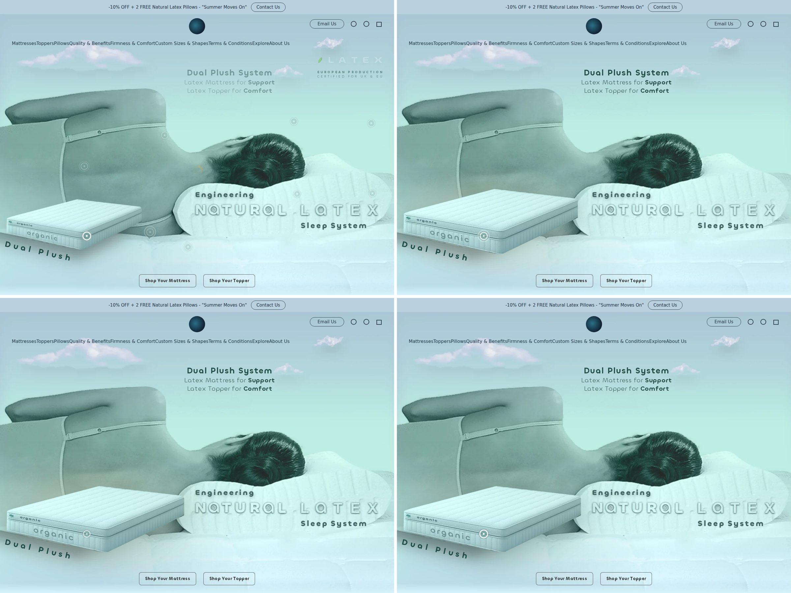

# Divine DunlopDreams Hero — engineering & design polish report

## 1.8.0 — Dual Plush "sunrise" (2026-10-02)

Owner's mockup: on the Dual Plush point the mattress comes forward, larger, over the woman's back; every other text disappears; the Dual Plush label stays.

* **Mattress layer** (`tests/make-mattress.py`): cut from the master along its measured silhouette (convex outline, anti-aliased), 1072×430 with alpha, 27 KB, fetched on first intent; never on phones.
* **Bloom**: scales 1 → 1.55 from its front-bottom-left corner over 1.25 s with a gentle overshoot (`cubic-bezier(.16,1.12,.3,1)`), soft drop shadow, and a warm dawn light rising behind it (1.6 s) that settles. Scaling about a point inside a convex shape always covers the original footprint, so the photo's mattress never shows twice; the right edge lands at 47% of the width (mockup). Closing reverses in 0.75 s; the layer hides only once back in place. Reduced-motion: crossfade only.
* **Everything else steps back**: LATEX lockup, the other points (and their hit areas — while it is open only the Dual Plush point is live, like night mode), baked benefits and DIVINE (their plates). "Dual Plush" (above the layer) and the Dual Plush System copy stay.
* Devices: ≥701px — all tablets (tap / tap again or tap elsewhere), laptops, Macs, monitors (hover in / out). Phones unchanged.
* Tests: new sunrise suite (no early download; bloom to ~47%; others hidden; label + copy stay; back to default; phone: nothing) — interaction 307–308 per harness, panels 792/792, axe 0, guards pass. Lab: phone LCP 0.80 s, CLS 0.
* Pinned staging section: `ecwid/section-1.8.0-jsdelivr.html` (commit `bfb1d12`).

## 1.7.2 — the moon on the logo's meridian (2026-10-02)

* The mockup's moon sat at 51.1% of the width; the site logo sits on the page centre. `tests/make-night.py` now shifts the whole frame (moon, glitter path, stars, clouds) so the moon centre is at exactly 50%.
* hero.js also measures the real header logo on every layout and shifts the night image by any remaining difference (clamped ±3%, scaled about the moon so no edge shows), e.g. if a scrollbar or an asymmetric header moves the logo.
* Measured on screenshots: moon centre = logo centre to the pixel at 1366, 1586 and 1920 wide. New interaction check; all suites green.
* Pinned staging section: `ecwid/section-1.7.2-jsdelivr.html` (commit `e1c57d6`).

## 1.7.1 — shoulder fix, night point like every other point (2026-10-02)

* **Shoulder no longer bulges** when a text opens (owner's iPad: "Balance & Relief"). The v26 logo plate carried its own drawing of the shoulder corner. `tests/make-logo-plate.py` rebuilds it from the photo: the shoulder contour is read off the photo (top y≈57, quarter-ellipse to the vertical side at x≈305, box px at 3554w), letters on the shoulder are filled from the shoulder only, letters + emboss halo on the sky from the photo's own sky (no faint plate box).
* **Night point** moved to the owner's spot (picture 50.5% / 53.2%, on the woman's back) and now behaves like the other points: the pointer comes near → night; leaves the range (slightly wider while night is on) → day. Tap, click, keyboard focus work too.
* **iPad with trackpad**: night mode was gated by `(hover:hover) and (pointer:fine)`, false on iPad (touch is its primary pointer), so it never loaded there. Now `(min-width:1051px) and (any-hover:hover)`; touch-only tablets/phones still never show or download it. Hidden points are excluded from hit-testing.
* Tests: interaction 291/291 per harness (night: position, near → night, away → day, return, no download on 3 touch viewports), panels 792/792, axe 0, guards pass.
* Pinned staging section: `ecwid/section-1.7.1-jsdelivr.html` (commit `a3b2583`).

## 1.7.0 — night mode (desktop) (2026-10-02)

Owner's mockup (`src/night/owner-mockup.png`): a moonlit night over the sea, the woman as a faint silhouette, one line "Improve the Quality of Your Sleep" and "Shop Your Latex Mattress / Topper".

* **The point**: a golden crescent in the sky above DIVINE, where the moon rises (kept under the header on cropped screens). Desktop with a mouse only: `(min-width:1051px) and (hover:hover) and (pointer:fine)`; tablets and phones never show it or download anything.
* **Click-only**: a whole-scene change is never triggered by a passing hover or by Tab focus; Enter/click opens it. The moon (the same button, now invisible over it), Esc, a click anywhere in the picture or outside, or scrolling away wakes up.
* **The plate** (`tests/make-night.py`): the owner's own frame — moon, star field, Milky Way, clouds, sea glitter and silhouette — with the site header, headline, buttons and faint photo inscriptions removed (stroke masks + fill + grain; stars restored in the cleaned header band at the surrounding density), placed in picture coordinates and continued above/below. 1640w 57 KB / 2560w 103 KB, fetched only after desktop intent (the layer is not rendered before, so its lazy image cannot load early).
* **Everything else steps back**: LATEX lockup, Dual Plush, the other 9 points (hover does nothing while it is night). Headline is live text (translated in the 8 languages; screen readers hear it). The buttons read "Shop Your **Latex Mattress** / **Latex Topper**" with a light outline on the water.
* **Site header**: its transparent menu sits on the night sky, so for the duration of night mode only, its text/links/icons are lightened (colour only; the one rule outside `.ddh`, allow-listed in the guard).
* Tests: interaction 295/295 per harness (incl. a night suite: no early download, click-only, everything hidden, headline, Latex buttons, moon/outside to wake, absent on 4 touch viewports), panels 792/792 (lowest contrast 4.86), axe 0, guards pass.
* Pinned staging section: `ecwid/section-1.7.0-jsdelivr.html` (commit `0c6c70e`).

## 1.6.0 — minimal, engineered: clean sky window, live Dual Plush, leaf in the slogan (2026-10-02)

Owner's brief: minimalist, precise, clearly readable — no haze, no "balloons".

* **Mist removed.** Instead the copy window lives only where the photo is calm: picture x 44–72.5% (right of the shoulder, left of the zones point). Its top is computed per screen (`--ddh-win-top`): 20% of the picture, but never under the header; on tablets/phones, where the LATEX block sits above the window, the block steps aside (fades) while a text is open, like the DIVINE logo. `tests/panels.mjs` composites the photo + logo plate on a canvas and checks the darkest 10% of every line's background against its ink: **lowest of 792 cases = 4.86:1** (WCAG AA for normal text is 4.5:1), no overlap with hair, header, lockup or zones point.
* **"conception" removed; "Dual Plush" is live text.** The baked curved lettering (with drop shadow and mirrored ghost) is removed from all 7 widths (`tests/clean-dualplush.py`: floor modelled by distance from the mattress edge + slow sideways trend, synthetic grain; ±1% file size). "Dual Plush" is now one line parallel to the mattress's lower front edge (measured 12.43°), spread by hero.js to exactly the mattress length, brand ink #1f4a45.
* **Leaf inside the slogan.** The leaf is the first sign of LATEX (a flex item of the word, spaced like a letter, counter-scaled against the word's flattening). "EUROPEAN PRODUCTION / CERTIFIED FOR UK & EU" form one block exactly as wide as LATEX (`[data-ddh-spread]`, recomputed on layout). Upright phones still hide leaf + certification.
* Window type slightly more compact (originals 1.6cqw, panels 1.42cqw; line-height locked).
* Tests: interaction 272/272 per harness, panels 792/792, axe 0, guards pass (records the removed "conception" and the live "Dual Plush"). Lab: phone LCP 0.77 s, CLS 0.
* Pinned staging section: `ecwid/section-1.6.0-jsdelivr.html` (commit `18fc483`).

## 1.5.1 — one safe window for every hotspot text (2026-10-02)

Owner's live iPad screenshot: "Levels of Adaptation" fell into the hair. Cause: the live site's custom-code CSS roughly doubled the line spacing of `p/span/strong` (lines ~2× apart), so the window grew downwards. Our imitation page did not have that rule, so the tests had passed.

* **Metrics locked**: copy and lockup line-height/margins now carry `!important`; the imitation page (`tests/make-ecwid-sim.py`) now ships the same inflation (`.ins-tile p{line-height:1.75;margin:0 0 1em}`, `.ins-tile span,strong{line-height:1.9}`) so this is tested from now on.
* **One window for all 8 brand-screen texts** (7 originals + 2 new), top-aligned, same rules everywhere: desktop plane x 37–72.5% from the DIVINE logo top; tablet / phone landscape x 33.5–65% (left of the LATEX lockup, which sits at the window's height there); small phones x 16–50%. The sweep also found that the original texts collided with the lockup on tablets/phone landscape and went under the header on 1366×768; the shared window fixes those too.
* **Cloud mist**: a feathered haze in the sky's colour behind window texts (no box, no edges) so copy reads on any part of the photo.
* `tests/panels.mjs`: 11 viewports × 9 languages × 8 texts = 792/792: no overlap with the hair (dark-pixel profile of the photo), the zones point, the header or the lockup; no spill. Interaction 272/272 per harness, axe 0, guards pass.
* Pinned staging section: `ecwid/section-1.5.1-jsdelivr.html` (commit `ba96b81`).

## 1.5.0 — two more points, a wider text window, eight languages (2026-10-02)

* **Two new hotspots** (owner's iPad mark-up), right edge: `sizes` under the certification line (plane 94.2% / 38%) and `weight` on the pillow (94.5% / 61.1%). Same pulse, same open/close behaviour, keyboard (roving tabindex now over 9 points), touch, no-JS `:has()` fallback.
  * sizes: **All UK & EU Sizes** / **Customisable** Mattress & Topper **Depths** / Different Depths for **Different Levels of Adaptation**
  * weight: **Firmness** Regulated by Body Weight / Soft · Medium · Firm · Extra Firm — each word one step heavier (400 → 400+stroke → 600 → 600+stroke; no extra font file).
* **"Window 3"**: their longer copy opens right of the DIVINE logo (the logo plate hides it meanwhile), plane x 44–72.5% so no line can reach the zones point; on desktop it starts level with the logo top, which the layout keeps under the header even on cropped 16:9 screens.
* **Translations** of all hotspot copy (9 points) for DE, SV, FR, ES, PT, EL, FI, IT. English stays in the HTML (what Google indexes). hero.js picks the page `lang`, else the browser's preferred language; an English browser preference wins. `<base>i18n/<lang>.json` (0.6–1.0 KB) is fetched after page load and only for those visitors. Test any language with `?ddh-lang=de`. Lines that would spill (German compounds, letter-spaced spine line) shrink to fit; the firmness scale wraps between words. Greek renders in the site font (Chillax has no Greek glyphs). **Translations should be reviewed by native speakers before launch.**
* **Fix**: the screen-reader announcement glued lines together ("Best Air VentilationTemperature Comfort"); now "Best Air Ventilation. Temperature Comfort".
* Tests: interaction 272/272 per harness (incl. 3 languages × 3 viewports, English downloads no translation), `tests/panels.mjs` 198/198 (11 viewports × 9 languages × 2 panels: no overlap with the zones point, header or lockup; no spill), axe 0, guards pass.
* Weight: section 6.9k characters; hero.css 4.2 KB + hero.js 3.9 KB compressed; lab LCP phone 0.75 s, CLS 0.
* Pinned staging section: `ecwid/section-1.5.0-jsdelivr.html` (commit `23eb60e`).

## 1.4.3 — clean pillow, hover on iPad (2026-10-02)

* **Smudge removed from the photo.** A soft dark leaf-shaped smudge (~90×120 px at 3554w) and a small speck were baked into the hero photo on the pillow, below "Sleep System" (owner's iPad screenshot). `tests/clean-smudge.py` lifts only the low-frequency darkening back to the surrounding level (robust local percentile), so the foam grain stays; applied to all 7 widths, each re-encoded within ±4% of its previous size.
* **Shop buttons darken on hover on iPad.** The hover rule was gated by `(hover:hover)`, which is false on an iPad even with a trackpad/mouse (its primary pointer is touch), so the graphite state appeared only on press. Now `(any-hover:hover)`. Phones without a pointer match neither, so no sticky hover after a tap. Guard added.
* Pinned staging section: `ecwid/section-1.4.3-jsdelivr.html` (commit `de9486d`). Tests: 156/156 per harness, axe 0, guards pass.

## 1.4.2 — hotspots no longer disturb the mattress or the shoulder (2026-10-02)

Reported on a live iPad (1366×1024): opening "Spinal Alignment" made the Dual Plush mattress shift and lose its crisp edge, and "Balance & Relief" did the same to the shoulder. Cause: the two v26 "clean background" plates (`plate-back`, `plate-logo`) replaced whole rectangles of the photo with a ~3× lower-resolution copy that also contained the mattress top and the shoulder/strap.

Fix (`tests/make-plates.py`): each plate is registered to the photo, tone-matched, and given an alpha mask that covers only the baked-in lettering (benefits list; DIVINE / Dunlop Dreams) plus a soft margin, restricted to the lettering zone. Change outside the lettering when a plate shows: before mean 2.8 / max 56 (of 255), now mean 0.00 / max 2. Plates 8.2 KB + 2.9 KB → 19.0 KB + 9.9 KB (fetched only on first hover/tap intent; never on an upright phone).

Pinned staging section: `ecwid/section-1.4.2-jsdelivr.html` (commit `8a6c3a6`). Tests: 156/156 per harness, axe 0, guards pass.

## 1.4.1 — search: image description and heading (2026-10-02)

* Hero image `alt`: "Woman sleeping on a natural latex pillow beside the Divine DunlopDreams Dual Plush latex mattress and topper". It describes what is in the picture, which is what Google Images and screen readers use.
* H1 (screen-reader/search heading; the live homepage's indexed text shows no other H1): "Divine DunlopDreams – 100% Natural Latex Mattresses, Toppers & Pillows. Engineering Natural Latex Sleep System". It keeps the v26 line and names the three products shown and linked in the hero.
* No hidden keyword text: Google's spam policies treat text hidden only for search engines as a violation. The visually hidden text the hero has describes what is on screen.
* Pinned staging section: `ecwid/section-1.4.1-jsdelivr.html` (commit `0c25c9b`). Tests: 156/156 interaction checks per harness, axe 0, guards pass (copy guard records the H1 change).

## 1.4.0 — upright phones: clean picture, no hotspots (2026-10-02)

Scope: phones only, `(max-width:700px) and (orientation:portrait)`. Desktop, laptop and tablet (incl. iPad portrait 1024×1366) are unchanged.

| | Phone upright | Phone sideways | Tablet / laptop / desktop |
|---|---|---|---|
| 7 hotspots + info panels + blue wash | hidden (`display:none`, out of tab order) | shown, all 7 work | shown, all 7 work |
| "European Production / Certified for UK & EU" + leaf | hidden | shown | shown |
| LATEX lettering, picture, Shop buttons | shown | shown | shown |

* JS guard: when the points are hidden, a tap opens nothing and the interaction graphics (≈15 KB) are never fetched. Rotating to upright while a panel is open closes it.
* The benefits list and certification sentence stay in the HTML for screen readers and search engines, whatever the orientation.
* Tests: 156/156 interaction checks on each of h0, h50, Ecwid sim, Ecwid sim with stripped inline styles. New checks cover upright 390×844 and 360×800 (hidden, inert, no plate requests, rotate → shown and working, rotate back → closed), and sideways 844×390 and 667×375. axe: 0 violations at 1440×900 and 390×844.
* Pinned staging section: `ecwid/section-1.4.0-jsdelivr.html` (commit `65a5407`, 6,239 characters, about 30% of the ~20k paste-truncation point).

Weight (Brotli, Slow 4G lab run, median of 3):

| Profile | Transferred | LCP | CLS |
|---|---|---|---|
| Phone 390×844@3, Slow 4G, 4× CPU | 96 KB | 1.14 s | 0 |
| Laptop 1440×900@2 | 214 KB | 0.20 s | 0.002 |
| Desktop 1920×1080@1 | 162 KB | 0.20 s | 0.002 |

hero.css 17.5 KB → 3.9 KB br; hero.js 8.9 KB → 3.2 KB br; no long tasks.

## 1.3.0 — full lettering, centred transparent CTAs, quieter phone hotspots (2026-10-02)

- **"Dual Plush conception" no longer cut.** The lettering ends at 84.2% of the picture height. New crop rule: keep the v26 crop (28% of the overflow from the top) unless it cuts the lettering; in that case lift the picture just enough to keep 85.5% visible, but never bring the DIVINE logo closer than 10 px to the header.
  - The lettering is now fully visible at 1366×845 (the iPad in the screenshot), 1440×900, 1536×864, 1728×1117, 1920×1080, 2560×1440, on tablets and on phones.
  - Only at 1366×768, where both cannot fit, does the hero grow 26 px past the screen. The Shop buttons stay anchored at the screen bottom.
- **Shop buttons.** Centred, clear of the chat bubble, and smaller (≈199×40 px on desktop). Transparent at rest, like the original cover, with a thin graphite outline and crisp dark lettering. Graphite with white lettering on hover, press or keyboard focus.
  - Phone: the bar is raised and compact.
  - Hotspots are kept ≥ 96 px above the screen bottom, so they never sit on the buttons.
- **Phone hotspots.** 14 px ring with a 21 px pulse (tablet: 17 px), down from 20/30 px; the pulse animation is unchanged. The touch target is still 40 px.
- **Fix.** The header scan is limited to the hero itself; a short hero on a page without a header no longer mistakes the next section for a header.
- **Tests.** 125/125 in all harnesses and in the Ecwid imitation (with styles stripped too). axe: 0 violations. Guards pass.

## 1.2.0 — short section, compact lockup, glass CTAs (2026-10-02)

**Why the hotspots and Shop buttons never appeared live.** Both live tests lost everything after roughly 20–22 thousand characters of the pasted code. The image survived, but the hotspots, the CTAs and the trailing `<script>` did not; with no script, the lockup sat at its CSS fallback position. Only one cut-off fits both pastes:

| pasted file | image ends | hotspots start | CTAs start | script starts |
|---|---|---|---|---|
| 1.0.0 all-in-one (28,826) | 17,989 ✔ shown | 20,199 | 21,889 ✘ | 22,184 |
| 1.1.0 all-in-one (32,267) | 20,124 ✔ shown | 22,334 ✘ | 23,763 ✘ | 24,058 ✘ |

→ the builder kept something between 20,124 and 21,889 characters. 1.2.0 is the **short form**: CSS and JS are external on jsDelivr (proven to load on the live site, because the hero images already come from there), and the section is **6,734 characters**.

It is also ordered so that a cut costs nothing essential:
1. `<link>` and `<script defer>` first;
2. then the image, hotspots and CTAs;
3. then the hidden hotspot copy;
4. last, an end marker `.ddh__end`. If it is missing, hero.js logs `[DDHero] … truncated` in the console.

**Design changes requested by the owner.**
- The duplicate Mattresses/Toppers/Pillows bar is removed; the Ecwid menu above already carries them.
- LATEX + certification form a compact lockup tucked under the header. Its right edge is aligned to the header's own right edge (measured `--ddh-edge-r`), and so is the CTA pair.
- Shop buttons are transparent "glass" at rest (outlined, readable) and turn graphite on hover, tap or keyboard focus.
- Ecwid's header, logo, menu and icons are never touched: measurement is read-only, nothing is restyled outside `.ddh`, and no events are stopped.

**Tests.** Interaction suite 125/125 (two links now) in the plain harnesses and in the Ecwid imitation, including with style attributes stripped. axe: 0 violations. Copy is unchanged apart from the removed bar.

## 1.1.0 — fitting the live Instant Site header (2026-10-02)

The live test on iPad showed that the Instant Site header (announcement bar, then a **transparent** header with logo, menu, Email Us and icons) lies **over** the first section. 1.0.0 was laid out as if the header pushed it down, which caused:

| Live symptom | Cause (reproduced in `tests/make-ecwid-sim.py`) | 1.1.0 |
|---|---|---|
| Mattresses/Toppers/Pillows + LATEX collided with Email Us / icons / menu | the lockup sat 16 px from the hero top, but the header covers about 120 px of it | `hero.js` measures the header (known `.ins-tile--header` tiles plus hit-testing of what sits on the hero). The lockup now sits 14–21 px **below** the header at every size |
| Hotspot circles not visible / not working | builder rules such as `.ins-tile button {position:relative}` (0,1,1) beat `.ddh__point` (0,1,0). If an editor strips `style=""`, all 7 points collapse to the top under the header | coordinates moved into CSS (`[data-ddh-point=…]`). Every selector scoped `.ddh .ddh__*`, plus `!important` on hotspot and CTA geometry. 7/7 points can be pressed, including with styles stripped |
| Another section showing at the bottom | hero height = screen − 50 − 16 px, a guess. The real offset is the 49 px announcement bar, and the 16 px "peek" was intentional | hero height = screen − measured offset, so it ends **exactly** at the screen bottom (Δ 0 px at all desktop sizes) |
| Composition not reaching under the menu like the old cover | — | desktop: picture from the hero top, so sky and clouds run behind the menu. The DIVINE logo is kept ≥ 36 px below the header. Tablet/phone: the picture starts just low enough for header + lockup to fit above DIVINE; the sky colour (#aac5d5, the picture's own top edge) continues behind the header |

Also handled: solid header (pushes content), so the hero fills the remaining screen; hero not first on the page, so it gets full height. Re-measured on load, resize, orientation change, font load and Instant Site tile load. Interaction suite: 131/131 in the Ecwid imitation (normal, styles stripped) and in the plain harnesses. axe: 0 violations. Copy guard: unchanged.

---

# 1.0.0 report (baseline polish)

Baseline: approved **v26** (`reference/v26-REFERENCE-SOURCE.html`, `reference/v26-preview.html`, both unmodified).
Result: **Hero 1.0.0 "baseline polished"**. It keeps the v26 composition, copy, model, mattress, clouds, lockup, graphite CTAs and seven pulsing hotspots, and fixes the defects measured below.
Optional, separate: **Variant A "Tone"** and **Variant B "Large display"**. Each is an override file that is never loaded by default.

Nothing was published, and the live site was not touched.

---

## A. What changed (baseline polished) — and why

Every change is either a measured defect fix or an invisible engineering change. Design-visible changes are marked **◆**.

| # | Change | Evidence (measured) |
|---|---|---|
| 1 | **◆ Phone: the certification line no longer overprints the DIVINE logo.** Lockup top 8→4 px, row gap 4→3 px, LATEX `12vw→11vw`. | v26 at 360/390/430 px: "Certified for UK & EU" drawn over "DIVINE" (`reports/compare/lockup-phone-360x800.jpg`). 1.0.0: the lockup ends above the logo ink at all three widths. |
| 2 | **◆ Lockup = one measured object.** LATEX L-ink starts exactly under the M of *Mattresses*, X-ink ends under *Pillows*. The rotated leaf shares the same left edge. Links→LATEX and LATEX→certification are equal intervals. | Pixel scan (`tests/lockup-pixels.mjs`). v26: L inset 3–4.5 px, gaps 13 / 23 px (1920). 1.0.0: all edges within ±1 px at 9 widths, gaps 13.5 / 13.0 px. |
| 3 | **◆ All seven hotspots are visible on every screen.** On desktop, a point that would fall within 34 px of the visible bottom edge is lifted just inside it (pure CSS, same crop formula). | v26: the *ventilation* hotspot was cropped out entirely on every 16:9 desktop (1920×1080, 2560×1440, 5K, 4K, 3008×1692). *Dual Plush* was half-cut at 1366×768. 1.0.0: 0 hidden points across 19 viewports. Points that were already visible do not move. |
| 4 | **Tap on a hotspot works on Android Chrome and touchscreen laptops.** Focus-open only for keyboard focus (`:focus-visible`). | v26: the tap focused the button (opens), then the click read as a "second tap" (closes), so nothing happened. 21/21 tap checks failed in v26 and pass in 1.0.0. iOS Safari doesn't focus buttons on tap, which is probably why this was never noticed. |
| 5 | **Correct `sizes` → sharp Retina / large monitors.** `sizes="100vw"` (the plane is full-bleed, so the rendered width is always the viewport width). An added **2880w** source (from the 3554 master, SSIM 0.991, better than the approved 2560's 0.9895). | v26's `min(100vw,1900px,(100vh-170px)*1.45)` described the cropped height, not the width. 1366×768 loaded 1200 px, 1920×1080 1640 px, 2560×1440 2048 px, 4K 2048 px (all upscaled). 1.0.0 always picks ≥ the device pixels needed. |
| 6 | **Image crop in CSS instead of JS** (`top:min(0px,(art-h − 100cqw·.772088)·.28)`). | Identical to v26's JS result to the pixel, at 38 viewport/header combinations. It removes a post-load layout shift: **CLS 0.051 / 0.065 → 0.000** (laptop / desktop). |
| 7 | **No `aria-hidden` ancestor around real links.** `aria-hidden` moved from the lockup to the decorative LATEX + certification only. | axe-core: v26 has a *serious* `aria-hidden-focus` violation; 1.0.0 has 0 violations (WCAG 2.2 AA + best practice). |
| 8 | **Lifecycle:** `DDHero.init/destroy/boot`, AbortController for all listeners, every observer disconnected, Instant Site `onTileLoaded/onTileUnloaded` hooks, safe script re-execution. | 25 simulated section re-renders + 5 script re-executions: document/window listener count unchanged, exactly one live region, still interactive. `destroy()` removes everything; `boot()` restores exactly one set. |
| 9 | **Interaction graphics load on intent** (first real pointer move / touch / keyboard focus on the hero), not with the page. | Before intent: 0 requests for plate/spine images. After: 3 (15 KB). Chrome fires a synthetic `pointerover` under a resting cursor, so `pointermove` is used. |
| 10 | **Fonts subset** to Latin + Latin-1 + Latin Extended-A + typographic punctuation (Chillax unchanged, both weights kept). | 41.8 KB → 25.7 KB. All hero copy plus Google-Translate Latin languages are covered. |
| 11 | Pointer proximity: hotspot centres cached (invalidated by ResizeObserver), hit-test coalesced to one per animation frame. | 1 rect read per frame instead of 8 per event. |
| 12 | Pulses pause while the hero is scrolled out of view. Hover lift only on real-hover devices; a `:active` pressed state for touch. | — |
| 13 | Live region announces on tap/click/keyboard only, not on every mouse hover. Escape closes from anywhere. | — |
| 14 | Removed dead code: `alignSkyLockup` (opt-in via an attribute the approved embed never set), `fitPlane` (now CSS), unused `--ddh-art-max`, `data-ddh-base`. | — |
| 16 | **◆ Ventilation "cooling" state, full frame.** Pressing the ventilation hotspot turns the whole artwork from mint to fresh sky-blue: an even cool cast plus a stronger blue rising from the mattress, and the bottom seam softens. Fades in/out over 0.45 s (opacity only). | v26 tinted only the lower half (0 → 30%), so the "temperature changes" idea barely read. On phones it never showed, because the tap didn't open (see #4). The layer now sits inside the image plane, above the logo plate and below the hotspots. |
| 17 | **◆ Phone: hotspot copy no longer overlaps the certification line.** The copy starts at 57% of the brand screen and flows down over the logo plate. | v26/early 1.0.0: 3-line copy (e.g. "Dual Plush System") overlapped "European Production" by up to 7 px at 360–390 px. Now clear for all 7 states at 360/390/430. |
| 15 | Opt-in `ddh--breakout` class (full-bleed escape if the Instant Site container proves padded). It is **not** enabled by default. | Tested inside a 1200 px / 40 px-padded container: the hero spans exactly 0→viewport width, with no horizontal scroll. |

**Unchanged on purpose:** composition, image crop, copy (41 text nodes identical, `tests/guards.mjs`), links, CTA graphite/geometry, hotspot design and pulse, breakpoints (700/1050/1051), tablet layout, `--ddh-bars:50px` contract, reduced-motion, forced-colours.

### Known v26 behaviours deliberately left as-is (your call)
* **Landscape windows ≤1050 px wide** (e.g. 1024×768 old iPad landscape, small browser windows) use the tablet layout, so the CTAs sit below the fold (CTA bottom 933 px at 1050×800 with a 50 px header). Current iPads in landscape (1080–1366 px) get the desktop framing. Changing the breakpoint logic was out of scope for a polish pass.
* **1366×768 with a 50 px header:** the CTAs overlap the bottom of the "Sleep System" artwork line, exactly as in v26.

---

## B. Optional design variants (separate files; baseline untouched)

| Variant | File | What | Cost |
|---|---|---|---|
| **A "Tone"** | `variants/variant-a-tone.css` | Graphite `#343a3c→#2f3638` with a 1 px top highlight. LATEX 27%→33% opacity (keeps presence over clouds). Certification in the link ink colour. Pulse 2.0 s→2.4 s (calmer). | +0.7 KB CSS, no geometry change |
| **B "Large display"** | `variants/variant-b-large-display.css` | Above 1920 px, lockup and hotspots keep their 1920 proportions up to 2560 px, then cap (baseline caps at 390 px: 15% of a 27″ screen width, 10% at 4K). CTAs stay at baseline size (scaled up they cover "Sleep System"). Pixel-identical to the baseline ≤1920 px. | +0.9 KB CSS |

Comparisons: `reports/compare/variant-a-*.jpg`, `reports/compare/variant-b-*.jpg`. Both pass the full 131-check interaction suite.
To adopt one: append its rules to `src/hero.css`, bump to 1.1.0, and rebuild. My recommendation: **B** is a genuine improvement for 27–32″ customers. **A** is taste, so judge it on a real Retina screen.

---

## C. Production code

| File | Size | Brotli |
|---|---|---|
| `ecwid/section-1.0.0.html` (Ecwid side, external CSS/JS) | **6,335 characters / 6,337 bytes**, 48 lines | 1.4 KB |
| `ecwid/section-1.0.0-allinone-jsdelivr.html` (Ecwid side, CSS/JS inline) | 28,826 characters | ≈7.5 KB |
| `release/1.0.0/hero.css` | 14,802 B | ≈3.5 KB |
| `release/1.0.0/hero.js` | 6,625 B | ≈2.4 KB |
| `release/1.0.0/assets/` | 2 fonts (25.7 KB), 7 hero widths 800–3554, 3 interaction graphics (15 KB) | — |

Readable sources: `src/`. Build: `node tests/build.mjs` (esbuild minify only, no bundling, no dependencies at runtime).

---

## D. Ecwid architecture report

**Official sources:** Ecwid Help Center, *Adding custom code to Instant Site* (support.ecwid.com/hc/en-us/articles/8359349900828), and Ecwid developer docs, *"Instant Site section load" events* (docs.ecwid.com/storefronts/track-storefront-events/instant-site-section-load-events). Both were read on 2026-10-01.

* There are three code locations: **header** (SEO settings → *Header meta tags and site verification*), **body** (Advanced website settings → *Custom JavaScript code*), and **page-specific sections** (Edit Site → Add Section → Advanced Solutions → *Embed & Custom Code* → *Add Custom Code Section*; HTML, CSS or JavaScript).
* **Character limit:** the documentation states "no longer than 4000 symbols" **only for the site-wide body *Custom JavaScript code* field**. It states **no limit** for the page-specific custom-code section. The 4,000 rule therefore does not apply to the hero section.
* **Our Ecwid-side code: 6,335 characters / 6,337 UTF-8 bytes. Decision: ONE section.** I could not open the live Ecwid editor from this sandbox. If the editor ever rejects it, follow the fallback ladder in INSTALL.md §9; a whitespace-minified variant is already provided.
* **Lifecycle:** Instant Site "sections (tiles) load and unload dynamically depending on the viewport" and exposes `window.instantsite.onTileLoaded/onTileUnloaded`. hero.js subscribes to both and runs an idempotent `boot()`: it destroys instances whose node left the DOM and initialises any new `.ddh`. A re-executed script reuses the existing `window.DDHero` (no duplicate). The inline one-liner after the script tag covers re-renders that re-run inline scripts but not cached external ones.
* **Why not split into multiple sections:** not needed (size fits, no stated limit). Splitting would expose the hero to independent tile lifecycles for no benefit.
* **Why not a native Custom Section (Vue/TypeScript via Ecwid's "Crane" CLI):** it gives editor-configurable fields, but requires an app/developer setup, a framework runtime and a redeploy for every change. That isn't justified for a fixed art-directed hero.
* **CSP:** the documentation has no CSP restriction for custom code sections, and third-party widget vendors (e.g. Elfsight) rely on external scripts there. Verify in the live test (INSTALL §8: "no console errors").
* **H1:** I could not fetch the live HTML from this sandbox (divinedunlop.com is blocked by its network policy). A text-only read of the homepage showed no top-level heading above the existing sections, so the visually hidden H1 is kept. INSTALL §8 has a one-line console check and the exact swap to `<h2>` if another H1 exists.
* **Collisions:** every selector is `.ddh`-scoped (124 rules checked automatically), and nothing touches `html`, `body`, `h1`, `a`, `img` or `section` globally. One global, `window.DDHero`; `data-ddh-*` attributes only.

---

## E. Performance report (lab, Chromium, local server with Brotli, median of 5)

| Profile | Build | LCP | CLS | Transfer (hero) |
|---|---|---|---|---|
| Phone 390×844@3, Slow 4G, 4× CPU | v26 | 876 ms | 0.000 | 98.9 KB |
| | **1.0.0** | **824 ms** | **0.000** | **83.8 KB** |
| Laptop 1440×900@2 (Retina) | v26 | 328 ms | 0.051 | 189 KB (*upscaled 2560*) |
| | **1.0.0** | **360 ms** | **0.001** | **189 KB** (*sharp 2880*) |
| Desktop 1920×1080@1 | v26 | 260 ms | 0.065 | 126 KB (*upscaled 1640*) |
| | **1.0.0** | 316 ms | **0.000** | 137 KB (*2048*) |

Long tasks: ≤14 ms total at 4× CPU, so negligible INP risk. Budgets: phone ≈84 KB (target ≤150 ✓), tablet/laptop 137–189 KB (≤250 ✓), 5K/6K/4K-at-2× 3554 px (≈250 KB; the largest genuine source, no fake upscale).
LCP element in all cases: the hero image (`fetchpriority="high"`, eager, intrinsic `width`/`height`, no lazy).
Desktop LCP is slightly higher because the browser now downloads the size the screen actually needs. That is the quality fix, not a regression.

**AVIF: not shipped.** Only lossy WebP derivatives exist (the multi-MB master isn't in the handover). Re-encoding them to AVIF saves about 42% at SSIM 0.993, but that is second-generation compression on top of WebP artefacts. Re-evaluate from the master (`INSTALL.md` §10 has the command).
**Whole homepage:** the live site couldn't be loaded from this sandbox, so this was a text-only read: the "Sleep Solution Navigator" with its own Shop buttons, product grids, many image sections and reviews. The hero adds 1 stylesheet, 1 deferred script, 1 image, 1–2 fonts and no long tasks, leaving the main thread free. Before going live, remove or hide any old cover/hero section above it, so two LCP candidates don't compete.

---

## F. Screenshot matrix

`reports/compare/<viewport>.jpg`: v26 | 1.0.0, side by side, with a 50 px store-header stand-in. 19 configurations:
360×800@3 · 390×844@3 · 430×932@3 · 768×1024@2 · 820×1180@2 · 1024×1366@2 (iPad portrait) · 1050×800 · 1051×800 · 1366×1024@2 (iPad landscape) · 1366×768 · 1440×900@2 (Retina) · 1536×864@1.25 · 1728×1117@2 (MBP 16) · 1920×1080 · 1920×1080@2 · 2560×1440 · 2560×1440@2 (5K/27″) · 3008×1692@2 (6K/32″) · 3840×2160 (4K).
Lockup close-ups: `reports/compare/lockup-*.jpg`. Raw metrics per viewport: `reports/matrix/*/metrics.json`.

Automated regression versus v26 at all 19 viewports × 2 header heights: hero/scene/art/image/CTA geometry **Δ = 0 px**, no horizontal overflow, full bleed (image x = 0, w = viewport), clouds/sky band unchanged, 0 hotspots hidden.

---

## G. Accessibility report

* axe-core 4 (WCAG 2.0/2.1/2.2 A+AA + best practice), desktop and phone: **0 violations** (v26: 1 serious).
* Real links (Mattresses / Toppers / Pillows / 2 CTAs) are exposed. LATEX and the visual certification are `aria-hidden`; the certification is spoken once via the hidden sentence.
* Hotspots: native `<button>`s with names, `aria-expanded` and `aria-controls`. Roving tabindex gives one Tab stop, with Arrow/Home/End to move, Enter/Space to open and Escape to close (also from anywhere on the page). Focus leaving the group closes it. A polite live region announces the opened copy.
* Touch: 46×46 px hotspot targets. Lockup links get an invisible ≥32 px-tall hit area without layout change. `touch-action:manipulation`. Dragging that starts on a hotspot scrolls the page (verified) and never opens a state.
* Reduced motion: pulse and fades off, points remain visible. Forced colours: system-colour rings and CTA borders.
* No-JS: all five links work. The CSS `:has()` fallback still reveals copy on hover/focus (it now also works on desktop, because the crop no longer needs JS).
* One H1 in the hero (see D for the live-page check).

## H. Code audit (v26 → 1.0.0), line-level findings

| Area | v26 finding | 1.0.0 |
|---|---|---|
| HTML | `aria-hidden` ancestor contains 3 focusable links | fixed |
| HTML | `sizes` describes height-constrained width; wrong at most desktop sizes | `100vw` + 2880w |
| HTML | `<picture>` with a single WebP `<source>` duplicating the `` | single `` (WebP is universal; `<picture>` wrapper kept only as a CSS hook) |
| JS | Touch tap = focusin-open + click-toggle-close (nothing happens) | keyboard-only focus open |
| JS | No `destroy`, listeners on `window`/`document`, 3 observers never disconnected | AbortController + disconnect + `destroy()` |
| JS | `pointermove` hit-test reads 8 bounding rects per event | cached centres, 1 read per frame |
| JS | `fitPlane` sets `top` after load → CLS 0.05–0.065 | CSS formula, CLS 0 |
| JS | Live region announces on every hover | only on activation |
| JS | `click` treats touch on a mouse-capable laptop as "precise" (`|| fine.matches`) | `pointerType` first; media query only when unknown |
| JS | `ddh--in-view` class toggled but never used | replaced by `ddh--offscreen` (pauses pulses) |
| JS | `alignSkyLockup` dead path (attribute never set) | removed |
| CSS | `--ddh-art-max` unused; hover styles stick after tap | removed; `(hover:hover)` guard |
| CSS | Ventilation hotspot cropped on 16:9 desktops | clamped into frame |
| Assets | Fonts carry ~360 glyphs incl. math/Greek | Latin subset, −39% |
| Assets | Interaction images: lazy but unprompted | intent-driven |

Tooling (`tests/`): `matrix.mjs` (screenshots + geometry), `lockup-pixels.mjs` (ink alignment), `interaction.mjs` (131 checks), `perf.mjs` (LCP/CLS), `a11y.mjs` (axe), `guards.mjs` (copy parity, CSS scoping, links, placeholders), `build.mjs`, `compose.py`.

## Final self-review

Preserved v26 ✓ · no redesign (design-visible changes = phone overlap fix, ±1 px lockup alignment, lifting cropped hotspots into view) ✓ · no empty bands, full bleed, clouds unchanged ✓ · lockup one geometric object ✓ · LATEX aligned ✓ · 7 hotspots work and pulse ✓ · links direct ✓ · iPad / small laptop / Retina ✓ · LCP not damaged (phone faster; desktop pays only for correct sharpness) ✓ · no listener leaks ✓ · Instant Site lifecycle safe ✓ · no libraries ✓.
